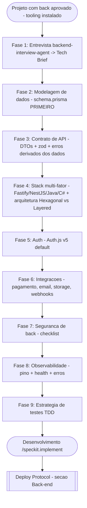

# Backend Onboarding Protocol

> ⚠️ **GATILHO:** Projeto com back-end aprovado (`tipo: front+back` no Kickoff, ou back-only) — tooling instalado (linha 17), antes de qualquer linha de código de back ser escrita.
> ⚠️ **TEMPLATE OBRIGATÓRIO:** Este protocolo (protocolo puro) + skill **backend-interview-agent** na Fase 1.
> ⚠️ **OUTPUT:** Tech Brief do back + modelagem de dados (`schema.prisma` draft) + contrato de API (DTOs/zod/erros) + decisão de arquitetura + plano de auth/integrações + checklists de segurança e observabilidade.
> ⚠️ **PRÓXIMO PASSO:** SDD com SpecKit — `/speckit.specify → plan → tasks → implement` (TDD por tarefa) → ao concluir + UAT: [[Deploy Protocol]] §Back-end.

---

## Contexto

Espelho do [[Frontend Creative Protocol]] para o lado servidor. A qualidade do back não vem de improviso: vem de requisitos entrevistados de verdade, **dados modelados primeiro**, contrato de API derivado dos dados, e segurança/observabilidade decididas antes do código. **Filosofia do dev: dados primeiro** — entidades e relacionamentos no `schema.prisma` são a fundação; DTOs, endpoints e casos de uso derivam deles.

> **Entrada via Kickoff (linha 20):** a seção 3 do `00-Input.md` traz os insumos brutos (requisitos, integrações, dados, porte). A Fase 1 usa esses insumos como ponto de partida da entrevista — não os substitui.

---

## Sub-fluxograma

---

## Fase 1 — Tech Brief (entrevista canônica)

**Mecanismo canônico: skill `backend-interview-agent`** (instalada) — conduz entrevista estruturada por rodadas temáticas e gera o **Tech Brief** completo do back.

- Insumo inicial: seção 3 do `00-Input.md` (requisitos, integrações, dados, porte) + briefing.
- O Tech Brief alimenta o `01-Escopo.md` (módulos de back) e as fases seguintes deste protocolo.
- Pergunta sem resposta = `[PENDENTE — perguntar ao dev/cliente]` (R3). **Nunca inventar requisito de back.**

---

## Fase 2 — Modelagem de Dados (PRIMEIRO — fundação de tudo)

> **Regra do dev: dados primeiro.** Nenhum endpoint, DTO ou caso de uso é escrito antes do modelo de dados estar desenhado.

1. **Entidades e relacionamentos** extraídos do Tech Brief → diagrama simples (Mermaid ER no `03-Planejamento`).
2. **`schema.prisma` draft** — declarativo, PostgreSQL default ([[Preferencias Dev]]): naming em inglês singular PascalCase para models, snake_case via `@@map` quando necessário; relações explícitas; índices para toda FK e campo de busca; `createdAt`/`updatedAt` em toda tabela.
3. **Estratégia de migrations:** `prisma migrate dev` no desenvolvimento, `prisma migrate deploy` em produção — migration nunca editada após aplicada.
4. **Seed** (`prisma/seed.ts`): dados mínimos de desenvolvimento + admin inicial; nunca dados reais de cliente.
5. Revisão do modelo com o dev ANTES da Fase 3 — mudança de schema depois do contrato de API custa caro.

---

## Fase 3 — Contrato de API (derivado dos dados)

- **DTOs explícitos** para toda entrada e saída — nunca expor entidades Prisma diretamente ([[Preferencias Dev#TypeScript]]).
- **Validação zod em TODA entrada** (body, params, query) — client E server.
- **Convenções REST:** recursos no plural, verbos HTTP semânticos, status codes corretos (200/201/204/400/401/403/404/409/422/500).
- **Formato de erro padrão único** do projeto: `{ error: { code, message, details? } }` — definido aqui e usado em todo handler.
- **Paginação padrão** (cursor-based para listas grandes; `page/perPage` para simples) + ordenação explícita.
- Next.js standalone → route handlers/server actions com a mesma disciplina de DTO+zod; NestJS → Controllers finos, lógica nos Services ([[Preferencias Dev#NestJS + Fastify]]).
- Contrato registrado no `03-Planejamento` (tabela endpoint → DTO → auth → erros).

---

## Fase 4 — Stack e Arquitetura

**4.0 Linguagem/framework — decisão multi-fator (regra do dev: "depende"):**

**Não há mapeamento mecânico.** Tamanho/escopo é UM dos parâmetros — pesam junto: complexidade do domínio, ecossistema/time do cliente, integrações enterprise, performance/concorrência, prazo/orçamento, infra alvo e manutenção futura. Checklist completo: [[Preferencias Dev#Escolha de Backend (multi-fator — "depende")]].

- Candidatos: Fastify puro (TS) · route handlers do Next standalone · NestJS + Fastify (default quando TS) · Java (Spring Boot) · C# (.NET).
- Os parâmetros vêm do Tech Brief/`00-Input.md`; a decisão é registrada no `03-Planejamento` + `INIT.md` **com os fatores que a justificaram**.
- **Sinais ambíguos/conflitantes = perguntar ao dev (R3/R5)** — o agente propõe com justificativa, nunca auto-decide a stack do back.

**4.1 Arquitetura:**

- **Decisão Hexagonal vs Layered** pela matriz de sinais de [[Preferencias Dev#Estrutura de Pastas por Stack]] — registrada no `03-Planejamento` + `INIT.md` (flag `architecture`).
- **Hexagonal soft** (padrão validado no Belessence): bounded contexts em `src/lib/` (ou módulos NestJS), cada contexto usa as camadas que fazem sentido — sem forçar ports/use-cases onde não há duplicação; promoção tardia permitida.
- R8: CLAUDE.md em toda pasta nova de contexto/camada.

---

## Fase 5 — Autenticação e Autorização

- **Default canon: Auth.js v5** (`next-auth` 5 + `@auth/prisma-adapter`) — padrão validado no Belessence (OAuth + credenciais + TOTP para admin). Stack Estendida: [[Preferencias Dev#Stack Estendida — Ecommerce]].
- **Exceção documentada:** API NestJS separada do front → JWT + Passport, registrada no `03-Planejamento` com justificativa.
- **Autorização SEMPRE no server** — roles/permissões verificados em cada handler/service; UI esconder botão ≠ segurança.
- Sessão: cookies `httpOnly`/`secure`/`sameSite` ([[Preferencias Dev#Segurança de Front-end (Cybersecurity)]]) — token em `localStorage` proibido.

---

## Fase 6 — Integrações

- Catálogo canônico na [[Preferencias Dev#Stack Estendida — Ecommerce]]: Mercado Pago (pagamento), Resend + react-email (transacional), Cloudinary (mídia), ViaCEP (frete/endereço).
- Cada integração declarada no Tech Brief com: env vars necessárias (→ `.env.example`), modo sandbox/produção, e **webhooks com validação de assinatura obrigatória** (nunca confiar em payload sem verificar origem).
- Integração fora do catálogo = validar contra R7 antes (Context7 + aprovação do dev).

---

## Fase 7 — Segurança de Back-end (checklist canon)

Complementa a [[Preferencias Dev#Segurança de Front-end (Cybersecurity)]] no lado servidor:

- [ ] **Toda entrada validada com zod no server** — nunca confiar no client, mesmo com validação no front
- [ ] **Rate limiting** em rotas públicas e de auth (`@fastify/rate-limit` no NestJS/Fastify; middleware/upstash no Next)
- [ ] **CORS restrito** aos domínios do projeto — nunca `*` em produção
- [ ] Headers de segurança no server (`@fastify/helmet` no NestJS; já cobertos via `next.config` no Next standalone)
- [ ] **Secrets só em env vars** validadas com zod no boot — nunca em código, log ou resposta de erro
- [ ] SQL injection coberto por Prisma (queries parametrizadas) — `$queryRaw` só com template literals tagged, nunca concatenação
- [ ] **Erros de produção não vazam stack trace nem detalhes internos** — formato de erro padrão da Fase 3
- [ ] Logs **sem PII/senha/token** — mascarar campos sensíveis no logger
- [ ] Senhas com hash forte (bcryptjs — canon da Stack Estendida); comparação em tempo constante
- [ ] Webhooks com verificação de assinatura (Fase 6)
- [ ] Uploads: MIME real + tamanho validados no server (espelho da regra do front)

---

## Fase 8 — Observabilidade

- **Logging estruturado: pino** (logger nativo do Fastify — zero dependência nova) com níveis por ambiente (`debug` dev / `info` prod).
- **Health check endpoint** (`/health` ou `/api/health`): status da app + conectividade com o banco — usado pelo Deploy Protocol e por monitor do VPS.
- Error tracking (Sentry ou similar): **opcional por projeto**, decidido no `03-Planejamento` conforme porte/orçamento — `[PENDENTE]` se o Tech Brief não definir.
- Toda exceção não tratada logada com contexto (rota, user id mascarado, payload sem PII).

---

## Fase 9 — Estratégia de Testes (SDD + TDD)

- **SDD forte com SpecKit** ([[Preferencias Dev#Fluxo SDD (SpecKit) — front E back]]): as saídas deste protocolo (Tech Brief, modelo de dados, contrato de API) alimentam `/speckit.specify → plan → tasks`; nenhuma implementação sem spec aprovada.
- **TDD obrigatório** ([[Preferencias Dev#Metodologia de Desenvolvimento: Akita + SDD + TDD]]): teste antes/junto da implementação, dentro do ciclo SDD.
- **Unit:** Vitest — services/casos de uso com mocks só de dependências externas.
- **Integração:** Vitest contra PostgreSQL real via Docker Compose (banco de teste isolado, reset por suite) — repositórios e queries Prisma testados de verdade.
- **E2E:** Playwright cobrindo os fluxos críticos que atravessam o back (auth, checkout, CRUD admin).
- Nenhuma tarefa `completed` sem testes passando.

---

## Quality Gate

- [ ] Tech Brief gerado via skill `backend-interview-agent` (Fase 1) — não de memória
- [ ] Modelo de dados desenhado e aprovado pelo dev ANTES do contrato de API (Fase 2)
- [ ] `schema.prisma` draft com relações, índices e timestamps + estratégia de migrations/seed definida
- [ ] Contrato de API registrado (endpoint → DTO → auth → erros) com zod em toda entrada
- [ ] Linguagem/framework do back decididos multi-fator (Fase 4.0), com fatores justificados e registrados (`03-Planejamento` + `INIT.md`) — ambiguidade levada ao dev, não auto-decidida
- [ ] Arquitetura decidida pela matriz de sinais e registrada (`03-Planejamento` + `INIT.md`)
- [ ] Auth definido (Auth.js v5 default ou exceção justificada)
- [ ] Integrações catalogadas com envs no `.env.example` + webhooks com assinatura
- [ ] Checklist de segurança de back (Fase 7) completo — verificado, não declarado (R2)
- [ ] pino + health check configurados
- [ ] Estratégia de testes definida (unit + integração com DB real + E2E)

---

## Referências

- `[[Preferencias Dev]]` — stack, filosofia, estrutura de pastas, segurança
- `[[Master Pipeline & Enforcement]]` — matriz canon (linha 22)
- `[[Project Kickoff Input Template]]` — seção 3 (insumos brutos do back)
- `[[Frontend Creative Protocol]]` — protocolo-espelho do front
- `[[Deploy Protocol]]` — §Back-end (Vercel vs VPS Hostinger por porte)
- `[[Spec-Kit Reference]]` — SDD+TDD pipeline
