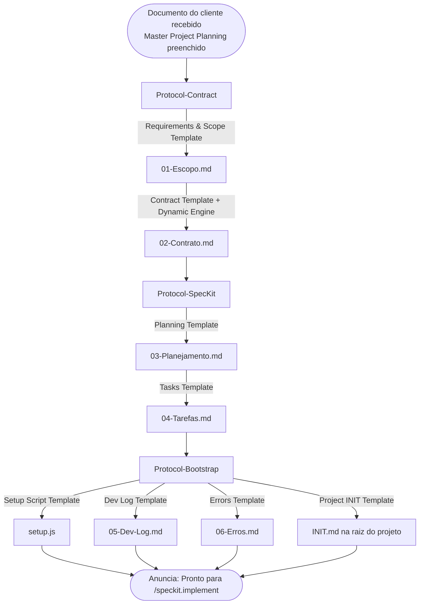

# Client Onboarding Protocol

> ⚠️ **GATILHO:** Usuário envia documento preenchido com estrutura do `[[Master Project Planning Template]]` (PDF, Word, Markdown).
> ⚠️ **TEMPLATES ACIONADOS (via sub-protocolos):** `[[Requirements & Scope Project Template]]` → `[[Contract Template]]` → `[[Planning Template]]` → `[[Tasks Template]]` → `[[Setup Script Template]]` + `[[Dev Log Template]]` + `[[Errors Template]]` + `[[Project INIT Template]]`.
> ⚠️ **OUTPUT FINAL:** estrutura completa do projeto em `Dev/2 - Projects/[Nicho]/[Cliente-Projeto]/` pronta para `/speckit.implement`.
> ⚠️ **PRÓXIMO PASSO:** desenvolvimento via Spec-Kit.
>
> **Propósito:** Orquestrador do fluxo de onboarding. Define gatilho, visão geral e sequência de delegação para sub-protocolos. Toda lógica de execução está nos sub-protocolos referenciados.

## Gatilho de Ativação

Sempre que o usuário enviar um documento preenchido com a estrutura do `[[Master Project Planning Template]]` (PDF, Word, Markdown), a IA executa este protocolo automaticamente.

---

## Fluxo de Execução



---

## Sub-Protocolos

| Sub-Protocolo | Responsabilidade | Artefatos Gerados |
|---|---|---|
| [[Protocol-Contract]] | Extração de metadados, contrato dinâmico, escopo técnico | `01-Escopo.md`, `02-Contrato.md` |
| [[Protocol-Bootstrap]] | Dev-Log, Erros, setup.js dinâmico (lê 01-Escopo.md) | `05-Dev-Log.md`, `06-Erros.md`, `setup.js` |
| [[Protocol-SpecKit]] | Planejamento EAP, tarefas BDD, quality gate final | `03-Planejamento.md`, `04-Tarefas.md` |

---

## Estrutura de Pastas Criada

```
Dev/2 - Projects/[Nicho]/[Cliente-Projeto]/
├── 01-Escopo.md
├── 02-Contrato.md
├── 03-Planejamento.md
├── 04-Tarefas.md
├── 05-Dev-Log.md
├── 06-Erros.md
└── setup.js
```

---

## Regras Gerais

- Documentos de onboarding ficam em `Dev/2 - Projects/[Nicho]/[Projeto]` — nunca em `Freelas/`.
- `Freelas/` contém código. `Dev/` contém documentação.
- `[[Master Project Planning Template]]` é a fonte primária. `01-Escopo.md` é a consolidação técnica estruturada (via `[[Requirements & Scope Project Template]]`).
- `setup.js` é gerado a partir do `01-Escopo.md` finalizado — nunca antes.
- Todos os documentos usam wikilinks `[[]]` para referências internas.
- Stack e metodologia conforme `[[Preferencias Dev]]`.

---

## Quality Gate do Orquestrador

- [ ] Todos os 4 sub-protocolos foram executados em sequência (Contract → SpecKit → Bootstrap)
- [ ] Cada artefato emitido usou seu template canon (ver banner do sub-protocolo)
- [ ] `[[Master Pipeline & Enforcement]]` foi consultado para confirmar gatilho → template
- [ ] Anúncio final emitido apenas após Quality Gate de TODOS os sub-protocolos

---

## Referências

- [[Protocol-Contract]] — Passo 1: contrato e escopo
- [[Protocol-Bootstrap]] — Passo 2: bootstrap e setup.js
- [[Protocol-SpecKit]] — Passo 3: planejamento e tarefas
- [[Dynamic Contract Engine]] — cláusulas dinâmicas por classificação
- [[Preferencias Dev]] — stack aprovada e regras inegociáveis
- [[Setup Script Template]] — estrutura do setup.js
