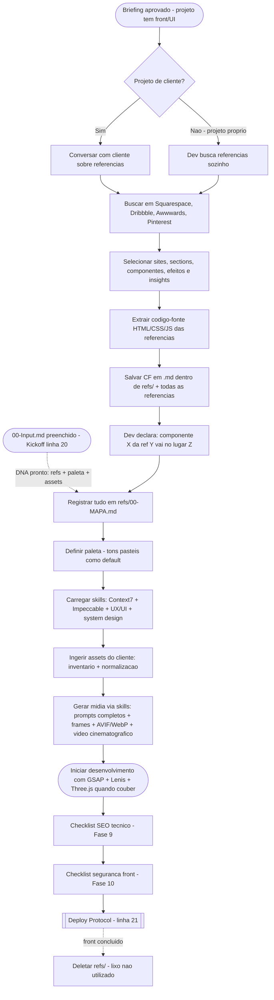

# Frontend Creative Protocol

> ⚠️ **GATILHO:** Projeto com front/UI aprovado (pós-briefing ou via `00-Input.md` do [[Project Kickoff Input Template]]) → antes de qualquer linha de código do front ser escrita.
> ⚠️ **TEMPLATE OBRIGATÓRIO:** Este protocolo (protocolo puro + estrutura canônica da pasta `refs/`).
> ⚠️ **OUTPUT:** Pasta `refs/` no repo do projeto (local, **fora do git**) + Mapa de Referências (`refs/00-MAPA.md`) + paleta aprovada + assets ingeridos/normalizados + pipeline de mídia definido + checklists de SEO e segurança anexados.
> ⚠️ **PRÓXIMO PASSO:** Desenvolvimento do front (`/speckit.implement`) com GSAP + Lenis (+ Three.js quando couber) → ao concluir + UAT: [[Deploy Protocol]] (matriz canon linha 21).

---

## Contexto

Este protocolo captura o **fluxo criativo canônico do dev para front-end/web**. Ele existe porque a qualidade visual dos projetos não vem de improviso: vem de referências curadas, extração fiel de efeitos, paleta intencional e um pipeline de mídia otimizado. Nenhum front começa sem passar por aqui.

> **Entrada via Kickoff (matriz canon linha 20):** quando o projeto nasce de um `00-Input.md` ([[Project Kickoff Input Template]]), o `00-DNA.md` já traz referências, identidade visual, paleta e inventário de assets prontos — as Fases 1–4 **consomem o DNA** em vez de partir do zero (validar contra o protocolo, não recriar). Campos ausentes no DNA = seguir a fase correspondente normalmente.

---

## Sub-fluxograma



---

## Fase 1 — Referências

**1.1 Origem das referências:**
- **Projeto de cliente:** conversar com o cliente sobre referências logo após o briefing.
- **Projeto próprio:** o dev busca as referências sozinho.

**1.2 Fontes de busca canônicas** (buscar sites inteiros, sections, componentes, efeitos e insights):

| Fonte | URL | O que buscar |
|---|---|---|
| Awwwards | https://www.awwwards.com/ | Sites premiados, efeitos de alto nível, insights |
| Dribbble | https://dribbble.com/ | Componentes, UI shots, direção de arte |
| Pinterest | https://www.pinterest.com/ | Moodboards, direção visual, paletas |
| Squarespace | https://www.squarespace.com/templates | Templates, estruturas de sections |
| v0 | https://v0.app/templates/ | UI components, projects, pages and layouts |

**1.3 Sites-referência de inspiração (paleta + nível de qualidade que o dev admira):**

| # | Site | URL |
|---|---|---|
| 1 | Lando Norris | https://landonorris.com/ |
| 2 | Igloo Inc | https://www.igloo.inc/ |
| 3 | Species in Pieces | http://species-in-pieces.com/# |
| 4 | Loiseau | https://loiseau.framer.website/ |
| 5 | NextSense | https://nextsense.io/ |
| 6 | Bucks Sauce | https://buckssauce.com/ |
| 7 | Nymphai Cosmetics | https://nymphaicosmetics.com/ |
| 8 | More Nutrition | https://more-nutrition.webflow.io/ |
| 9 | Cipher Digital | https://cipherdigital.com/ |
| 10 | Day 1 Run | https://day1-run.webflow.io/ |
| 11 | Nudot | https://nudot.com.tw/ |
| 12 | Terminal Industries | https://terminal-industries.com/ |
| 13 | Oryzo | https://oryzo.ai/ |

> Esta lista é viva: novos sites que o dev admirar entram aqui (bump de versão + entrada em `[[MEMORY]]`).

---

## Fase 2 — Extração de Código-Fonte (CF)

Para ter **facilidade e fidelidade** à referência, o dev extrai o código-fonte (HTML, CSS e JS) dos sites selecionados.

**Estrutura canônica da pasta `refs/`** (raiz do repo de código do projeto):

```
refs/
├── 00-MAPA.md                  # Mapa de Referências (ver Fase 3)
├── <nome-da-ref-1>.md          # CF (HTML/CSS/JS) + link + prints + notas do que interessa
├── <nome-da-ref-2>.md
└── assets/                     # screenshots / vídeos de referência (opcional)
```

**Regras inegociáveis da `refs/`:**

1. **`refs/` NUNCA sobe no git.** Entrada obrigatória no `.gitignore` do projeto na criação da pasta. Ela vive apenas no repo local.
2. **Ciclo de vida:** `refs/` permanece no repo local **até o front do projeto ser concluído**. Depois disso, o dev **deleta** a pasta — lixo que não é mais utilizado não fica no projeto.
3. **CF é material de estudo e fidelidade, não de cópia.** O código extraído serve para entender estrutura, timing de animação e técnica do efeito. A implementação final é **re-escrita do zero** dentro da stack canon (`[[Preferencias Dev]]`) — copiar HTML/CSS/JS substancial de terceiros para projeto de cliente é risco de copyright.
4. Como `refs/` é gitignored, ela é **exceção automática à R8** (não precisa de `CLAUDE.md`).

---

## Fase 3 — Mapa de Referências (`refs/00-MAPA.md`)

Depois das refs coletadas, o dev declara ao agente **o que quer de cada referência e onde**. Isso vira o `00-MAPA.md`:

```markdown
# Mapa de Referências — {{PROJETO}}

| Referência | Componente / Efeito | Onde entra no projeto | Observações |
|---|---|---|---|
| landonorris.com | Hero com scroll horizontal | Hero da home | Adaptar pra paleta pastel |
| igloo.inc | Transição de section 3D | Section "Sobre" | Three.js — avaliar peso |
| ... | ... | ... | ... |
```

O agente **só implementa componentes de referência que estejam no mapa**. Referência sem destino declarado = perguntar ao dev (R3/R5).

---

## Fase 4 — Paleta e Identidade Visual

- **Default do dev: tons pastéis** — como nos sites-referência da Fase 1.3.
- **Entrada via Kickoff:** quando existe `00-DNA.md` (linha 20), esta fase **parte dos proto-tokens já extraídos das refs** (paleta hex/OKLCH, tipografia, espaçamentos — item 2 do contrato de resposta do `[[Project Kickoff Input Template]]`) e os refina; sem Kickoff, extrair aqui a partir do CF das refs (Fase 2) — skill complementar `[[ai-web-designer-agent]]` para extração de design system a partir de código.
- A paleta final considera: **equilíbrio visual, contraste (WCAG) e tom**.
- Tokens no `tailwind.config.ts` / `globals.css` — hex hardcoded proibido (`[[Preferencias Dev#Tailwind + Shadcn]]`).
- `/impeccable init` → `DESIGN.md` registra a paleta como fonte da verdade do projeto (proto-tokens do DNA são ponto de partida, `DESIGN.md` é a versão final).

---

## Fase 5 — Skills e Integridade de Código

Antes de desenvolver, garantir carregado/instalado (via `[[Protocol-Bootstrap]]` Passo 7):

| Ferramenta / Skill | Papel |
|---|---|
| **Context7 MCP** | Docs em tempo real de toda lib usada — nunca adivinhar API |
| **Impeccable** | Design QA + anti-AI-slop — `[[Impeccable Reference]]` |
| **Skills de UX/UI e design** | Melhoria contínua de usabilidade e interface |
| **Noções de system design** | Arquitetura do front conforme `[[Preferencias Dev#Filosofia de Construção]]` |

---

## Fase 6 — Pipeline de Mídia

**6.0 Ingestão de assets do cliente — o cliente apenas ENVIA; o dev INPUTA:**

Não existe asset de cliente entrando no projeto sem passar por aqui:

1. **Inventário** — o dev registra cada asset recebido no `00-Input.md`/`00-DNA.md` (via `[[Project Kickoff Input Template]]`): arquivo, tipo, slot previsto, fundo transparente?, qualidade OK?, licença/direito de uso.
2. **Validação de qualidade** — padrão cinematográfico high-ticket: vídeo abaixo de 1080p ou imagem abaixo do alvo @2x do slot (`[[Asset Sizing Standard]]`) é **rejeitado** → pedir original melhor ao cliente ou regenerar. **Nunca subir asset ruim.**
3. **Normalização** — enhance (Upscayl, se necessário) → resize pela matriz do Asset Sizing → **AVIF+WebP** (imagem) / **transcode ffmpeg WebM+MP4 + poster** (vídeo). GIF recebido = transcodificar para WebM/MP4.
4. Asset normalizado entra em `public/` (ou pipeline do framework); o original bruto fica fora do git (mesma regra da `refs/`).

**6.1 Geração de artes e vídeos — REGRA INEGOCIÁVEL (skills sempre acionadas):**

Toda geração de imagem ou vídeo — por IA direta, MCP conectado (ex.: Higgsfield) ou qualquer gerador — DEVE acionar as **skills e padrões instalados**:

| Obrigatório | Papel |
|---|---|
| **Higgsfield skills** (instaladas no bootstrap — linha 17) | Skills de geração de mídia do agente |
| `[[Asset Sizing Standard]]` | Tamanho/ratio/formato calculado ANTES de gerar + frames iniciais/finais + bleed + alpha |
| `[[GPT-Image Prompt Galleries]]` | Prompts curados (4 galerias preferidas + craft.md) como base de estilo |
| `DESIGN.md` do projeto (Impeccable) | Paleta e identidade que o prompt DEVE obedecer |

**Prompts complexos e completos são obrigatórios** — construídos a partir das galerias + paleta/identidade + regras do repo; prompt "curto de cabeça" = violação de R7. Slots que podem virar vídeo → gerar **frame inicial + frame final**; necessidade de fundo transparente → **declarada no prompt** (saída com alpha). Detalhes: `[[Asset Sizing Standard]]` §Imagens para animação.

| Situação | Ferramenta |
|---|---|
| Higgsfield disponível (créditos/pago) | Higgsfield skills — `[[Higgsfield Skills Reference]]` |
| **Sem orçamento (situação atual)** | Alternativas gratuitas abaixo |

**Alternativas gratuitas aprovadas:**

| Tipo | Ferramenta | Observação |
|---|---|---|
| Imagem | Google AI Studio (Gemini) | Free tier generoso, alta qualidade |
| Imagem (assets de design) | Recraft | Free tier, foco em vetor/design pra web |
| Imagem | Leonardo.ai / Ideogram | Créditos diários grátis |
| Imagem (local, ilimitado) | ComfyUI / Fooocus + Flux/SDXL | Exige GPU |
| Vídeo | Kling / Hailuo / Luma Dream Machine | Créditos diários/free tier limitados |
| Vídeo (alternativa) | GSAP/Three.js bem feitos | Muitas vezes substituem vídeo gerado em hero sections |

**6.2 Enhance de imagem:**
- **Upscayl** (open source, local, gratuito) — upscale/enhance padrão.

**6.3 Conversão de formato — REGRA INEGOCIÁVEL:**
- **Toda imagem PNG/JPEG destinada ao navegador é convertida para AVIF (1ª escolha) + WebP (fallback)** — alinhado à matriz de formatos do `[[Asset Sizing Standard]]` (AVIF q≈50–60 fica ~30–50% menor que WebP).
- **WEBP puro é o mínimo aceitável** quando AVIF não for viável no pipeline (ferramenta sem suporte, transparência complexa).
- Conversão em lote via **`sharp`** (npm) em script do projeto; avulsa via **Squoosh** (squoosh.app).
- **Vídeo:** WebM VP9 + MP4 H.264 fallback via **ffmpeg**, poster frame AVIF/WebP, ≥1080p — comandos canônicos em `[[Asset Sizing Standard]]` §Vídeo. **GIF proibido.**
- Em projetos Next.js, `next/image` já serve AVIF/WebP automaticamente — ainda assim, assets estáticos em `public/` entram como AVIF+WebP.

---

## Fase 7 — Princípios de Web Design (checklist de desenvolvimento)

Todo front produzido DEVE respeitar os princípios básicos que o dev valoriza:

- [ ] **Arquitetura da informação** clara
- [ ] **Hierarquia visual** bem definida
- [ ] **Projetado para vários dispositivos** (responsivo de verdade)
- [ ] **Acessível e inclusivo** (WCAG)
- [ ] **Cores com equilíbrio visual, contraste e tom**
- [ ] **Layout conduz os olhos do usuário**
- [ ] **Espaço negativo** usado para destacar conteúdo
- [ ] **Informações mais importantes primeiro**
- [ ] **Navegação fácil**
- [ ] **Design que se destaca**

---

## Fase 8 — Ferramentas-Assinatura do Desenvolvimento

O que dá "outro sentimento" ao site e eleva o nível:

| Ferramenta | Uso | Regra |
|---|---|---|
| **GSAP** | Animações | Sempre. `useGSAP` obrigatório, `prefers-reduced-motion` — `[[Preferencias Dev#GSAP + Lenis]]` |
| **Lenis** | Smooth scroll | Sempre. ScrollTrigger integrado via `requestAnimationFrame` |
| **Three.js** | 3D / WebGL | **Quando couber** (peso vs. impacto avaliado no `03-Planejamento`). Aprovado na stack — `[[Preferencias Dev#Three.js]]` |

---

## Fase 9 — SEO Técnico (checklist canon)

Obrigatório para site institucional / landing page / qualquer front público. Referência de implementação Next.js: `[[Next.js Foundations (Vercel Academy)]]` (Metadata API).

- [ ] **Metadata** por rota: `metadata` estática ou `generateMetadata` dinâmica (title com template `%s | Site`, description)
- [ ] **`metadataBase`** definido no root layout (URLs absolutas resolvem)
- [ ] **OG image 1200×630** (único tamanho fixo — `[[Asset Sizing Standard]]`) + Twitter card `summary_large_image`
- [ ] **`sitemap.xml`** gerado (`app/sitemap.ts` no Next) e referenciado no robots
- [ ] **`robots.txt`** (`app/robots.ts`) — rotas privadas/preview bloqueadas
- [ ] **Schema.org / JSON-LD** conforme o nicho: `Organization`/`LocalBusiness` (institucional), `Product` (e-commerce), `Article` (blog), `Event`/`FAQPage` quando couber
- [ ] **Canonical** absoluto por página (evita conteúdo duplicado)
- [ ] **Favicon + manifest** (ícones nos tamanhos padrão, `site.webmanifest`)
- [ ] Headings semânticos (um `h1` por página, hierarquia sem furos) + `alt` em toda imagem de conteúdo

---

## Fase 10 — Segurança de Front-end (checklist canon)

Regras completas: `[[Preferencias Dev#Segurança de Front-end (Cybersecurity)]]`. Checklist aplicado ANTES do Quality Gate final:

- [ ] Security headers configurados (CSP, HSTS, `nosniff`, Referrer-Policy, Permissions-Policy, `frame-ancestors`)
- [ ] Zero segredos no client — disciplina `NEXT_PUBLIC_` + env vars validadas com zod no boot
- [ ] Nenhum `dangerouslySetInnerHTML` sem DOMPurify; entradas validadas com zod (client E server)
- [ ] Formulários públicos com validação server-side + rate limiting + honeypot/Turnstile
- [ ] Cookies `httpOnly` + `secure` + `sameSite`; nada de token em `localStorage`
- [ ] `pnpm audit` limpo (sem high/critical) + lockfile commitado
- [ ] Embeds de terceiros sandboxed; uploads validados no server (MIME real + tamanho)

---

## Quality Gate

- [ ] Referências buscadas nas fontes canônicas (ou justificativa de fonte alternativa) — ou consumidas do `00-DNA.md` (Kickoff)
- [ ] `refs/` criada na raiz do repo com CF em `.md` + **entrada no `.gitignore` no mesmo commit da criação do repo**
- [ ] `refs/00-MAPA.md` preenchido — todo componente de referência tem destino declarado
- [ ] Paleta definida (default pastel) com contraste WCAG validado, registrada no `DESIGN.md`
- [ ] Context7 + Impeccable + skills de UX/UI carregados
- [ ] **Assets do cliente ingeridos e normalizados** (Fase 6.0: inventário + validação de qualidade + AVIF+WebP/ffmpeg)
- [ ] **Toda geração de mídia passou pelas skills** (Higgsfield skills + Asset Sizing + GPT-Image galleries) com prompts completos; frames inicial/final gerados para slots que viram vídeo
- [ ] Pipeline de mídia definido (geração + Upscayl + conversão **AVIF+WebP** + vídeo WebM/MP4 via ffmpeg)
- [ ] Checklist de princípios de web design (Fase 7) anexado ao `03-Planejamento` ou `DESIGN.md`
- [ ] **Checklist de SEO técnico (Fase 9) completo** — sitemap, robots, JSON-LD, metadata, OG
- [ ] **Checklist de segurança (Fase 10) completo** — headers, XSS, forms, cookies, audit
- [ ] **Pós-conclusão do front + UAT:** acionar `[[Deploy Protocol]]` (linha 21); `refs/` deletada (registrar no `05-Dev-Log`)

---

## Referências

- `[[Preferencias Dev]]` — stack, DX obrigatória, segurança e regras inegociáveis
- `[[Master Pipeline & Enforcement]]` — matriz canon (linhas 19, 20 e 21)
- `[[Project Kickoff Input Template]]` — porta de entrada do projeto (`00-Input.md` → `00-DNA.md`)
- `[[Asset Sizing Standard]]` — tamanhos, formatos, vídeo cinematográfico, image-to-video
- `[[GPT-Image Prompt Galleries]]` — prompts curados de geração
- `[[Deploy Protocol]]` — publicação pós-front
- `[[Protocol-Bootstrap]]` — instalação do tooling
- `[[Impeccable Reference]]` — design QA
- `[[Higgsfield Skills Reference]]` — mídia IA (quando disponível)
