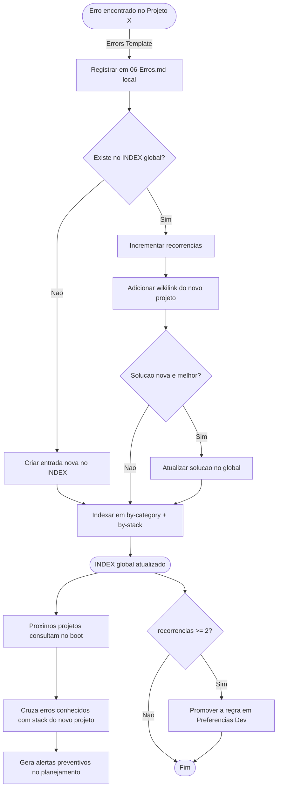

# M6 — Immunological Error Memory System 🛡️

> ⚠️ **GATILHO:** erro encontrado em qualquer projeto OU recorrência detectada em projeto novo.
> ⚠️ **TEMPLATE OBRIGATÓRIO (local):** `[[Errors Template]]` — base do `06-Erros.md` do projeto.
> ⚠️ **SCHEMA OBRIGATÓRIO (global):** YAML definido neste arquivo (campos: id, título, categoria, stack, severidade, sintoma, causa_raiz, solução, prevenção, recorrências).
> ⚠️ **OUTPUT:** `06-Erros.md` local + entrada em `[[4 - Error's Memory/INDEX]]` + `by-category/` + `by-stack/`. Se recorrências ≥ 2: regra promovida em `[[Preferencias Dev]]`.

Este módulo define o sistema **global de registro, deduplicação e consulta de erros** que opera de forma independente do nicho ou projeto. Seu objetivo é garantir que **nenhum erro se repita no ecossistema**.

---

## Princípio Central

> Um erro resolvido em um projeto de advocacia deve **vacinar automaticamente** um futuro projeto de e-commerce. Erros nunca se repetem.

A `4 - Error's Memory/` não é um log passivo — é um sistema imunológico ativo que:
- **Registra** erros globalmente com deduplicação
- **Classifica** por categoria técnica e por tecnologia da stack
- **Consulta** proativamente em 3 pontos do pipeline
- **Promove** erros recorrentes a regras permanentes

---

## Estrutura da Pasta `4 - Error's Memory/`

```
4 - Error's Memory/
├── INDEX.md                  ← Catálogo geral de todos os erros
├── by-category/              ← Erros agrupados por tipo técnico
│   ├── Dependency Breaks.md
│   ├── API Integration.md
│   ├── Auth & Security.md
│   ├── Performance.md
│   ├── State Management.md
│   └── Deployment.md
└── by-stack/                 ← Erros agrupados por tecnologia
    ├── React.md
    ├── NestJS.md
    ├── Tailwind & Shadcn.md
    └── GSAP & Lenis.md
```

---

## Schema de Registro de Erro

Cada erro no `INDEX.md` deve seguir este formato padronizado:

```yaml
- id: ERR-YYYY-NNNN
  título: "Descrição curta e clara do erro"
  categoria: State Management    # deve corresponder a um arquivo em by-category/
  stack:                         # lista de tecnologias afetadas
    - React
    - GSAP & Lenis
  severidade: alta               # baixa | média | alta | crítica
  projeto_origem: "Nicho/Cliente-Projeto"
  data_descoberta: YYYY-MM-DD
  sintoma: "Mensagem de erro ou comportamento observado"
  causa_raiz: "Explicação técnica do porquê aconteceu"
  solução: "O que foi feito para resolver"
  prevenção: "Como evitar que aconteça novamente"
  recorrências: 0                # Incrementado cada vez que o erro reaparece
  links:
    - "[[Cliente-Projeto/06-Erros]]"
    - "[[4 - Error's Memory/by-stack/tecnologia]]"
    - "[[4 - Error's Memory/by-category/categoria]]"
```

### Campos Obrigatórios

| Campo | Obrigatório | Propósito |
|---|---|---|
| `id` | ✅ | Identificador único sequencial (ERR-YYYY-NNNN) |
| `título` | ✅ | Descrição curta para busca rápida |
| `categoria` | ✅ | Classificação técnica para indexação |
| `stack` | ✅ | Tecnologias afetadas para cruzamento cross-niche |
| `severidade` | ✅ | Priorização de alertas |
| `sintoma` | ✅ | O que o desenvolvedor vê (mensagem de erro, comportamento) |
| `causa_raiz` | ✅ | Por que aconteceu (nível técnico) |
| `solução` | ✅ | O que resolveu |
| `prevenção` | ✅ | Como evitar no futuro |
| `recorrências` | ✅ | Contador — gatilho para promoção a regra |

---

## Fluxo de Propagação Cross-Niche



---

## Protocolo de Deduplicação

O agente **DEVE** seguir estes passos ao registrar um novo erro:

| # | Ação | Condição |
|---|---|---|
| 1 | Buscar no `INDEX.md` por sintoma ou causa raiz similar | Sempre |
| 2 | Se encontrado: **incrementar `recorrências`**, adicionar wikilink do novo projeto, atualizar `solução` se melhor | Erro duplicado |
| 3 | Se não encontrado: criar nova entrada com ID sequencial `ERR-YYYY-NNNN` | Erro novo |
| 4 | Classificar nos arquivos `by-category/*.md` e `by-stack/*.md` | Sempre |
| 5 | Gerar wikilink bidirecional `[[]]` entre o erro local (`06-Erros.md`) e o global (`INDEX.md`) | Sempre |

### Critérios de Similaridade

Para determinar se um erro é "o mesmo":
- **Mesma causa raiz** (independente do sintoma superficial)
- **Mesma tecnologia** com **mesmo padrão de falha**
- Em caso de dúvida, registrar como novo e marcar `relacionado_a: ERR-YYYY-XXXX`

---

## Regra Anti-Repetição: Promoção a Regra Permanente

> ⚠️ **Se `recorrências >= 2`, o erro é promovido a regra permanente.**

Quando um erro atinge 2 recorrências:

1. O agente **DEVE** inserir uma nova regra na seção "Regras Promovidas da Memória Imunológica" do [[Preferencias Dev]]
2. A regra incluirá:
   - O anti-padrão a ser evitado
   - A solução correta
   - Referência ao erro original via `[[ERR-YYYY-NNNN]]`
3. A partir desse momento, o agente aplica a regra **antes** que o erro possa ocorrer

**Isso garante que erros sistêmicos sejam eliminados na raiz e nunca mais passem pela fase de planejamento.**

---

## Consulta Obrigatória no Pipeline

A Memória Imunológica é consultada **ativamente** em 3 momentos:

| Momento | Ação da IA | Resultado |
|---|---|---|
| **Boot de sessão** | Ler `INDEX.md` para contexto geral | Consciência de erros recentes |
| **Pré-planejamento** (`/speckit.plan`) | Cruzar stack do novo projeto com `by-stack/*.md` | Alertas preventivos no plano |
| **Pós-implementação** (`/speckit.implement`) | Validar código contra `by-category/*.md` | Checklist de anti-padrões |

---

## Indexação Dupla: Categoria + Stack

### Por Categoria (`by-category/`)

Cada arquivo agrupa erros por **tipo de problema técnico**:

| Arquivo | Tipos de Erros |
|---|---|
| `Dependency Breaks.md` | Conflitos de versão, pacotes deprecated, breaking changes |
| `API Integration.md` | Contratos quebrados, CORS, timeout, serialização |
| `Auth & Security.md` | Vulnerabilidades, tokens, sessões, LGPD |
| `Performance.md` | Memory leaks, re-renders, bundle size, LCP |
| `State Management.md` | Hydration mismatch, race conditions, cache stale |
| `Deployment.md` | Build failures, env vars, CI/CD, DNS |

### Por Stack (`by-stack/`)

Cada arquivo agrupa erros por **tecnologia específica**:

| Arquivo | Escopo |
|---|---|
| `React.md` | Hooks, Server Components, hydration, re-renders |
| `NestJS.md` | DI, Guards, Pipes, módulos, TypeORM |
| `Tailwind & Shadcn.md` | Config, tokens, componentes, responsividade |
| `GSAP & Lenis.md` | ScrollTrigger, cleanup, useGSAP, requestAnimationFrame |

---

## Referências Internas

- `[[Errors Template]]` — template canon do `06-Erros.md` local
- `[[Master Pipeline & Enforcement]]` — matriz canon do vault
- `[[Cognitive Vault Architecture]]` — Onde a pasta `4 - Error's Memory/` vive
- `[[Session Protocol]]` — Boot sequence inclui leitura do INDEX.md
- `[[Project Lifecycle Pipeline]]` — Consulta pré-planejamento obrigatória
- `[[Preferencias Dev]]` — Destino das regras promovidas
