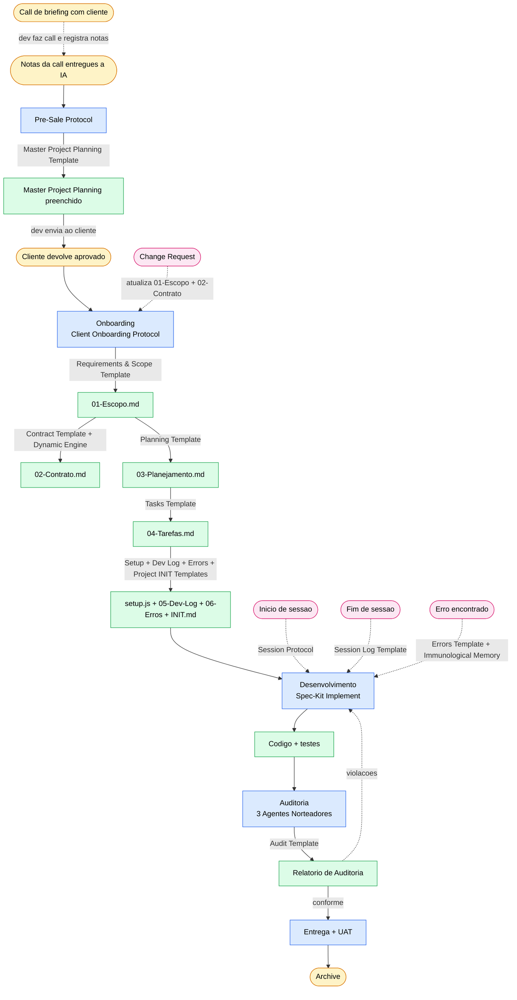

# M0 — Master Pipeline & Enforcement 🧠

> ⚠️ **ESTE ARQUIVO É CANON.** Toda ação no vault que produza um artefato declarado na matriz abaixo DEVE usar o template canon listado. Não há "estrutura livre" para artefatos da matriz. Não há "versão resumida" do template.
>
> Leitura obrigatória em **todo boot de sessão**, antes de qualquer execução. Referenciado pelo `[[Session Protocol]]` e pelo `[[CLAUDE]]` raiz.

---

## 1. Fluxograma Macro

**Legenda:**

- 🟡 **trigger** — evento que aciona uma fase ou ação
- 🔵 **phase** — fase do pipeline com protocolo dedicado
- 🟢 **artifact** — artefato emitido por template canon
- 🌸 **session** — fluxo transversal (boot, shutdown, erro, change request)

---

## 2. Matriz Canon — Gatilho → Template → Output → Próximo passo

| # | Gatilho | Template canon | Output | Próximo passo |
|---|---|---|---|---|
| 0 | Dev compartilha notas/transcrição da call de briefing | `[[Master Project Planning Template]]` (via `[[Pre-Sale Protocol]]`) | Master preenchido + lista de pendências para o dev levar ao cliente | Dev envia ao cliente |
| 1 | Cliente devolve Master aprovado/preenchido | — (já preenchido na rodada 0) | Aciona `[[Client Onboarding Protocol]]` | Início do onboarding |
| 2 | Onboarding iniciado | `[[Requirements & Scope Project Template]]` | `01-Escopo.md` em `Dev/2 - Projects/[Nicho]/[Cliente-Projeto]/` | `[[Protocol-Contract]]` |
| 3 | `01-Escopo.md` aprovado | `[[Contract Template]]` + `[[Dynamic Contract Engine]]` | `02-Contrato.md` | `[[Protocol-SpecKit]]` |
| 4 | `01-Escopo.md` aprovado | `[[Planning Template]]` | `03-Planejamento.md` | Geração de tarefas |
| 5 | `03-Planejamento.md` aprovado | `[[Tasks Template]]` | `04-Tarefas.md` | `[[Protocol-Bootstrap]]` |
| 6 | Tarefas prontas → iniciar setup | `[[Setup Script Template]]` | `setup.js` na raiz do projeto no vault | Inicializar 05/06/INIT |
| 7 | Setup gerado | `[[Dev Log Template]]` | `05-Dev-Log.md` | — |
| 8 | Setup gerado | `[[Errors Template]]` | `06-Erros.md` | — |
| 9 | Pasta do projeto criada (código) | `[[Project INIT Template]]` | `INIT.md` na raiz do projeto de código | Boot per-projeto |
| 10 | Subpasta/nicho criada dentro do projeto | `[[Niche CLAUDE Template]]` | `CLAUDE.md` na subpasta | — |
| 11 | Início de sessão | `[[Session Protocol]]` (protocolo, sem template) | Estado restaurado | Aguardar instrução |
| 12 | Fim de sessão | `[[Session Log Template]]` | `Dev/3 - Session Logs/YYYY-MM-DD_HH-MM.md` + `[[MEMORY]]` atualizado | Próxima sessão |
| 13 | Erro encontrado em projeto | `[[Errors Template]]` (entry local) + schema do `[[Immunological Error Memory]]` | `06-Erros.md` + `[[4 - Error's Memory/INDEX]]` + `by-category/` + `by-stack/` | Mitigação |
| 14 | Auditoria de código | `[[Audit Template]]` | Relatório de auditoria | Aplicar correções |
| 15 | Change Request (escopo muda) | — (atualizar `01-Escopo` + `02-Contrato` + replan) | `01-Escopo.md`/`02-Contrato.md` atualizados | `/speckit.plan` |
| 16 | Recorrência ≥ 2 de erro | — (promoção automática a regra) | Nova entrada em "Regras Promovidas" do `[[Preferencias Dev]]` | Aplicação preventiva |

---

## 3. Regras de Enforcement (Inegociáveis)

1. **Todo artefato listado na matriz vem do template canon.** Não há exceção.
2. **Templates não são copiados de cabeça.** O agente abre o template real, copia o conteúdo, substitui as `{{VARIÁVEIS}}` e salva o arquivo gerado no destino correto.
3. **Quality Gate do protocol DEVE incluir checkbox** "Artefato foi gerado a partir de `[[Template X]]` como base".
4. **Versão resumida do template é proibida.** Se uma seção não se aplica ao projeto, ela aparece com a marcação `N/A — [motivo]`, não é omitida.
5. **Banners `⚠️` nos protocols** declaram GATILHO + TEMPLATE OBRIGATÓRIO + OUTPUT + PRÓXIMO PASSO antes do conteúdo. A IA lê o banner antes de qualquer ação.
6. **Mudanças no template canon** exigem incremento da `version` no frontmatter + entrada em `[[MEMORY]]` documentando o motivo.
7. **Regras constitucionais R1–R6** do `[[CLAUDE]]` raiz precedem qualquer instrução deste arquivo. Em caso de conflito, vencem as constitucionais.
8. **Validação mecânica** via `node tools/validate-project.js "Dev/2 - Projects/[Nicho]/[Projeto]"` é o gatekeeper final antes de declarar o onboarding completo.
9. **Teste de aceitação** via `[[Mock Pipeline Test]]` deve ser executado mentalmente sempre que um template ou protocol for editado.

---

## 4. Sub-fluxogramas por Fase

Cada protocolo tem seu sub-fluxograma Mermaid dentro do próprio arquivo. Este Master só mostra o macro.

| Fase | Arquivo com sub-fluxograma |
|---|---|
| Pre-venda (notas → Master preenchido) | `[[Pre-Sale Protocol]]` |
| Onboarding (orquestração) | `[[Client Onboarding Protocol]]` |
| Contrato | `[[Protocol-Contract]]` |
| Planejamento + Tarefas | `[[Protocol-SpecKit]]` |
| Bootstrap (setup.js + 05/06/INIT) | `[[Protocol-Bootstrap]]` |
| Boot/Shutdown de sessão | `[[Session Protocol]]` |
| Propagação de erro | `[[Immunological Error Memory]]` |
| Auditoria | `[[0.2 - Audit/Diretrizes]]` |
| Comandos `/speckit.*` (com fallback manual) | `[[Spec-Kit Reference]]` |

---

## 5. Fluxos Transversais

### 5.1 Boot de sessão
Canon: `[[Session Protocol]]`. Boot Sequence em 6 passos. Não há template — é protocolo puro.

### 5.2 Fim de sessão
Canon: `[[Session Protocol]]` → aciona `[[Session Log Template]]` para o log e atualiza `[[MEMORY]]`.

### 5.3 Erro encontrado
Canon: `[[Immunological Error Memory]]`. Template local: `[[Errors Template]]`. Propagação: 06-Erros local → INDEX global → by-category + by-stack → (se recorrências ≥ 2) regra promovida em `[[Preferencias Dev]]`.

### 5.4 Change Request
Sem template — atualiza `01-Escopo.md` + `02-Contrato.md` (cláusula de Controle de Escopo) + `/speckit.plan` para replan.

---

## 6. Quick Map — Quando vejo X, eu uso Template Y

> Atalho de raciocínio para a IA. Substitui inferência por lookup direto.

| Vejo / sou acionado por... | Uso obrigatoriamente o template... |
|---|---|
| Dev compartilha notas/transcrição da call de briefing | `[[Master Project Planning Template]]` (via `[[Pre-Sale Protocol]]`) |
| Cliente devolveu o Master aprovado | `[[Requirements & Scope Project Template]]` (via `[[Client Onboarding Protocol]]`) |
| 01-Escopo aprovado, gerar contrato | `[[Contract Template]]` + `[[Dynamic Contract Engine]]` |
| 01-Escopo aprovado, gerar planejamento | `[[Planning Template]]` |
| Planejamento aprovado, gerar tarefas | `[[Tasks Template]]` |
| Bootstrap do projeto (setup.js) | `[[Setup Script Template]]` |
| Bootstrap — inicializar 05-Dev-Log | `[[Dev Log Template]]` |
| Bootstrap — inicializar 06-Erros | `[[Errors Template]]` |
| Bootstrap — gerar INIT.md per-projeto | `[[Project INIT Template]]` |
| Criando CLAUDE.md em subpasta de projeto | `[[Niche CLAUDE Template]]` |
| Fim de sessão, gerar log | `[[Session Log Template]]` |
| Registrando erro local | `[[Errors Template]]` |
| Rodando auditoria de código | `[[Audit Template]]` |

---

## Referências

- `[[Pre-Sale Protocol]]` — notas da call → Master preenchido
- `[[Project Lifecycle Pipeline]]` — fluxo de fases (alto nível) e responsáveis
- `[[Cognitive Vault Architecture]]` — estrutura de pastas e taxonomia
- `[[Session Protocol]]` — boot/shutdown canônico
- `[[Preferencias Dev]]` — stack e regras inegociáveis
- `[[Immunological Error Memory]]` — sistema imunológico de erros
- `[[Client Onboarding Protocol]]` — orquestrador do onboarding
- `[[Spec-Kit Reference]]` — comandos `/speckit.*` + fallback manual
