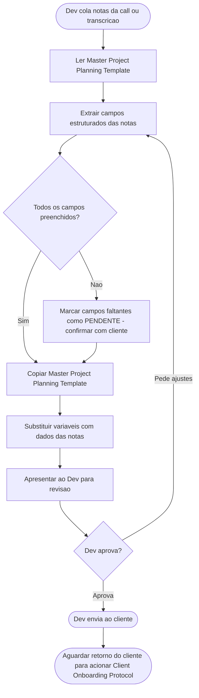

# Pre-Sale Protocol

> ⚠️ **GATILHO:** Dev compartilha com a IA as notas / bullets / transcrição da call de briefing com o cliente.
> ⚠️ **TEMPLATE OBRIGATÓRIO:** `[[Master Project Planning Template]]` (como output).
> ⚠️ **OUTPUT:** Master Project Planning Template preenchido + lista de pontos pendentes para o dev confirmar com o cliente.
> ⚠️ **PRÓXIMO PASSO:** Dev revisa, complementa o que falta, envia ao cliente. Quando cliente devolve preenchido/aprovado → `[[Client Onboarding Protocol]]`.

---

## Contexto

Este protocolo cobre a fase **pré-onboarding**: a partir do momento em que o dev compartilha as notas brutas da call de briefing, a IA estrutura o briefing no formato canon do `[[Master Project Planning Template]]`.

Não substitui a conversa com o cliente — é a etapa de **tradução das anotações em documento estruturado**.

---

## Sub-fluxograma

---

## Passos

**1. Receber notas da call**
O dev cola na conversa: notas, bullets, ou transcrição da call de briefing.

**2. Extrair dados estruturados**
A IA mapeia os dados das notas para os campos do `[[Master Project Planning Template]]`:

| Campo do template | O que extrair das notas |
|---|---|
| `{{CLIENT_NAME}}` | Nome da empresa ou cliente |
| `{{CLIENT_CONTACT}}` | PO (ponto de contato) |
| `{{MARKET_NICHE}}` | Nicho de mercado |
| `{{START_DATE}}` | Data acordada de início |
| `{{END_DATE}}` | Data acordada de entrega |
| `{{BUDGET_TIER}}` | Tier de investimento |
| Dor central / Visão / Público-alvo | Seção 1.1 |
| Módulos / User Stories | Seção 2 (se mencionados) |
| Stack desejada | Seção 3 (se mencionado) |
| Integrações | Seção 3.1 |
| Dependências extras | `{{DEPENDENCIES}}` |
| Exclusões de escopo | Seção 4 |
| Cronograma | Seção 6 |

**3. Copiar o template canon**
Abrir `[[Master Project Planning Template]]`, copiar conteúdo completo, substituir `{{variáveis}}` pelos dados extraídos das notas. Nunca escrever do zero — sempre copiar o template e substituir.

**4. Marcar pendências**
Onde a informação não estiver clara nas notas, marcar `[PENDENTE — confirmar com cliente: <pergunta específica>]`. **Não inventar.**

**5. Apresentar ao dev**
Mostrar o documento preenchido + lista consolidada de pendências (perguntas específicas para o dev levar ao cliente).

**6. Aguardar devolução do cliente**
Após o dev enviar e o cliente devolver aprovado/preenchido, acionar `[[Client Onboarding Protocol]]`.

---

## Quality Gate

- [ ] **Documento foi gerado a partir de `[[Master Project Planning Template]]` como base** (não escrito do zero)
- [ ] Todas as `{{variáveis}}` substituídas ou marcadas como `[PENDENTE — confirmar com cliente: <pergunta>]`
- [ ] Nenhuma informação inventada — só o que foi mencionado nas notas
- [ ] Lista de pendências apresentada ao dev (perguntas específicas, não vagas)
- [ ] Dev aprovou antes de enviar ao cliente
- [ ] `[[Client Onboarding Protocol]]` NÃO foi acionado ainda — só quando cliente devolver

---

## Regras

- **Não inventar.** Se não está nas notas, marca como pendente.
- **Não pular o template canon.** Mesmo com notas incompletas, o documento gerado segue 100% a estrutura do Master.
- **Não acionar Client Onboarding agora.** Esse protocolo ENTREGA ao dev. O Client Onboarding só dispara quando o cliente devolver aprovado.
- **Stack desejada pelo cliente cruzada com `[[Preferencias Dev]]`** — se cliente pediu algo fora da stack aprovada, sinalizar como pendência ao dev (não como decisão técnica).

---

## Referências

- `[[Master Project Planning Template]]` — template canon do briefing
- `[[Client Onboarding Protocol]]` — protocolo que dispara DEPOIS, quando o cliente devolver aprovado
- `[[Master Pipeline & Enforcement]]` — matriz canon do vault
- `[[Preferencias Dev]]` — stack aprovada (para validar pedidos do cliente)
