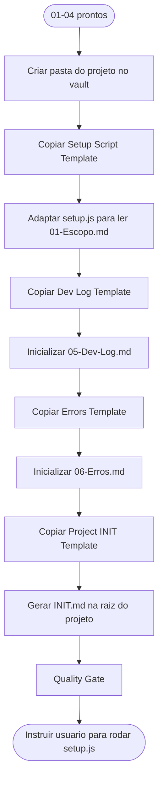

# Protocol — Bootstrap do Projeto

> ⚠️ **GATILHO:** `01-Escopo.md`, `02-Contrato.md`, `03-Planejamento.md` e `04-Tarefas.md` criados e salvos em `Dev/2 - Projects/[Nicho]/[Projeto]/`.
> ⚠️ **TEMPLATES OBRIGATÓRIOS:** `[[Setup Script Template]]` (para `setup.js`) + `[[Dev Log Template]]` (para `05-Dev-Log.md`) + `[[Errors Template]]` (para `06-Erros.md`) + `[[Project INIT Template]]` (para `INIT.md` da raiz do projeto de código).
> ⚠️ **OUTPUT:** 4 arquivos gerados no diretório do projeto no vault + `INIT.md` na raiz do projeto de código.
> ⚠️ **PRÓXIMO PASSO:** desenvolvimento via `/speckit.implement`.
>
> Sub-protocolo do `[[Client Onboarding Protocol]]`. Responsabilidade única: criar a estrutura de pastas do projeto no vault e gerar o `setup.js` portátil + os 3 artefatos de tracking (Dev Log, Errors, INIT).

---

## Sub-fluxograma



---

## Gatilho

`01-Escopo.md`, `02-Contrato.md`, `03-Planejamento.md` e `04-Tarefas.md` criados e salvos.

---

## Passos

**1. Criar estrutura de pastas no vault**

```
Dev/2 - Projects/[Nicho]/[Cliente-Projeto]/
├── 01-Escopo.md       ← já existe
├── 02-Contrato.md     ← já existe
├── 03-Planejamento.md ← já existe
├── 04-Tarefas.md      ← já existe
├── 05-Dev-Log.md      ← criar agora
├── 06-Erros.md        ← criar agora
└── setup.js           ← gerar agora
```

**2. Inicializar `05-Dev-Log.md`**
Copiar `[[Dev Log Template]]` como base, substituir variáveis, registrar: data de início, estado "Onboarding concluído. Aguardando aprovação do escopo e contrato."

**3. Inicializar `06-Erros.md`**
Copiar `[[Errors Template]]` como base, substituir variáveis. Arquivo iniciado com schema YAML vazio. Erros sempre propagados para `[[4 - Error's Memory/INDEX]]`.

**4. Gerar `setup.js`**
Seguir o `[[Setup Script Template]]` — o script lê `01-Escopo.md` em runtime, nunca tem conteúdo hardcoded.

O `setup.js` faz apenas bootstrap:
- Lê `01-Escopo.md` via `fs` usando `__dirname`
- Parseia frontmatter (project name, frontend_stack, dependencies)
- Roda scaffold da stack (ex: `npx create-next-app`)
- Instala dependências base + extras do escopo
- Cria arquivos de configuração (tsconfig, next.config, vitest, .env.example)
- Cria estrutura de pastas `src/`
- Roda smoke test ao final

**5. Registrar em `05-Dev-Log.md`**
Registrar que o `setup.js` foi gerado e como usá-lo.

**6. Gerar `INIT.md` na raiz do projeto de código**
Copiar `[[Project INIT Template]]` como base, substituir variáveis. Este arquivo NÃO fica no vault — vai para a raiz do projeto de código (`Freelas/[Projeto]/INIT.md`). É o boot per-projeto.

**7. Instruir o usuário**
```
Para criar o projeto na sua pasta de trabalho, rode em qualquer terminal:

  cd C:\sua\pasta\de\projetos
  node "caminho\para\Dev\2 - Projects\[Nicho]\[Projeto]\setup.js"

Após o setup.js rodar, copie o INIT.md gerado para a raiz do projeto criado.
```

---

## Quality Gate

- [ ] **`05-Dev-Log.md` foi gerado a partir de `[[Dev Log Template]]` como base**
- [ ] **`06-Erros.md` foi gerado a partir de `[[Errors Template]]` como base**
- [ ] **`setup.js` foi gerado a partir de `[[Setup Script Template]]` como base**
- [ ] **`INIT.md` foi gerado a partir de `[[Project INIT Template]]` como base**
- [ ] `setup.js` lê `01-Escopo.md` via `__dirname` (sem conteúdo hardcoded)
- [ ] `setup.js` instala apenas deps declaradas no escopo + base da stack
- [ ] Smoke test roda e passa ao final do script
- [ ] Usuário instruído sobre como usar o `setup.js`

---

## Referências

- `[[Setup Script Template]]` — base do `setup.js`
- `[[Dev Log Template]]` — base do `05-Dev-Log.md`
- `[[Errors Template]]` — base do `06-Erros.md`
- `[[Project INIT Template]]` — base do `INIT.md` per-projeto
- `[[Preferencias Dev]]` — stack aprovada e regras de bootstrap
- `[[Client Onboarding Protocol]]` — orquestrador
- `[[Master Pipeline & Enforcement]]` — matriz canon do vault
