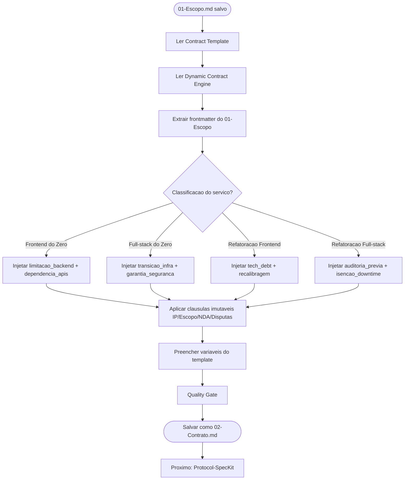

# Protocol — Geração de Contrato

> ⚠️ **GATILHO:** `01-Escopo.md` preenchido e salvo em `Dev/2 - Projects/[Nicho]/[Projeto]/`.
> ⚠️ **TEMPLATE OBRIGATÓRIO:** `[[Contract Template]]` + `[[Dynamic Contract Engine]]`.
> ⚠️ **OUTPUT:** `02-Contrato.md` no mesmo diretório.
> ⚠️ **PRÓXIMO PASSO:** `[[Protocol-SpecKit]]`.
>
> O artefato DEVE ser produzido copiando o `[[Contract Template]]` e substituindo variáveis pelo Dynamic Contract Engine. Nunca escrever do zero. Nunca usar versão resumida.

> Sub-protocolo do `[[Client Onboarding Protocol]]`. Responsabilidade única: gerar o `02-Contrato.md` a partir do `01-Escopo.md` aprovado.

---

## Sub-fluxograma

---

## Gatilho

`01-Escopo.md` preenchido e salvo em `Dev/2 - Projects/[Nicho]/[Projeto]/`.

---

## Passos

**1. Ler fontes**
- `Dev/1 - Templates/Contract Template.md` — estrutura base
- `Dev/0 - Planner Project/Dynamic Contract Engine.md` — lógica de cláusulas
- `01-Escopo.md` do projeto — variáveis e classificação

**2. Extrair variáveis do frontmatter do `01-Escopo.md`**

| Variável do contrato | Campo no frontmatter |
|---|---|
| `{{CLIENT_NAME}}` | `cliente` |
| `{{START_DATE}}` | `data_inicio` |
| `{{END_DATE}}` | `data_entrega` |
| `{{PROJECT_VALUE}}` | `valor` |
| `{{SERVICE_TYPE}}` | `classificacao` |

**3. Aplicar Dynamic Contract Engine**
Consultar [[Dynamic Contract Engine]] e injetar cláusulas conforme `classificacao`:
- `Frontend do Zero` → Limitação de Backend + Dependência de APIs
- `Full-stack do Zero` → Transição de Infraestrutura + Garantia de Segurança
- `Refatoração Frontend` → Descoberta de Tech Debt + Recalibragem de Cronograma
- `Refatoração Full-stack` → Auditoria Prévia + Isenção de Downtime

**4. Preencher todas as variáveis** no `Contract Template.md` com os dados extraídos.

**5. Salvar** em `Dev/2 - Projects/[Nicho]/[Projeto]/02-Contrato.md`.

---

## Quality Gate

- [ ] **Artefato foi gerado a partir de `[[Contract Template]]` como base** (não escrito do zero, não versão resumida)
- [ ] Todas as variáveis `{{}}` substituídas
- [ ] Cláusulas dinâmicas da classificação aplicadas
- [ ] Cláusulas imutáveis presentes: IP, Controle de Escopo, NDA, Resolução de Disputas
- [ ] Nenhuma seção resumida ou omitida

---

## Referências

- [[Dynamic Contract Engine]]
- [[Contract Template]]
- [[Client Onboarding Protocol]]
