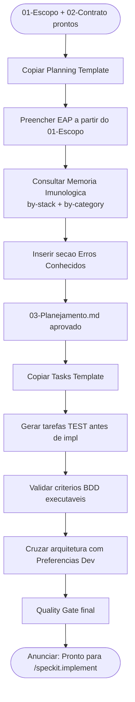

# Protocol — Spec-Kit & SDD+TDD Init

> ⚠️ **GATILHO:** `01-Escopo.md` aprovado e `02-Contrato.md` gerado.
> ⚠️ **TEMPLATES OBRIGATÓRIOS:** `[[Planning Template]]` (para `03-Planejamento.md`) + `[[Tasks Template]]` (para `04-Tarefas.md`).
> ⚠️ **OUTPUT:** `03-Planejamento.md` + `04-Tarefas.md` validados com BDD executável.
> ⚠️ **PRÓXIMO PASSO:** `[[Protocol-Bootstrap]]` para gerar setup.js + 05-Dev-Log + 06-Erros + INIT.md.
>
> Sub-protocolo do `[[Client Onboarding Protocol]]`. Responsabilidade única: gerar `03-Planejamento.md` + `04-Tarefas.md` e anunciar que o projeto está pronto para desenvolvimento.

---

## Sub-fluxograma

---

## Gatilho

`01-Escopo.md` aprovado e `02-Contrato.md` gerado.

---

## Passos

**1. Gerar `03-Planejamento.md`**
Copiar `[[Planning Template]]` como base, substituir variáveis a partir do `01-Escopo.md`. Consultar `[[4 - Error's Memory/INDEX]]` e preencher a seção "Erros Conhecidos".

**2. Gerar `04-Tarefas.md`**
Copiar `[[Tasks Template]]` como base. Cada tarefa deve ter:
- ID único (ex: `T-1.1`)
- User Story de origem (referência ao `01-Escopo.md`)
- Arquivos afetados
- Critério de aceite BDD (`GIVEN / WHEN / THEN`)
- Status inicial: `pending`
- Tarefas `[TEST]` presentes ANTES das de implementação

**3. Confirmar critérios BDD executáveis**
Cada User Story do `01-Escopo.md` §4 deve ter pelo menos um critério BDD no `04-Tarefas.md` que se traduz diretamente em teste Playwright ou Vitest.

**4. Cruzar arquitetura com `[[Preferencias Dev]]`**
Verificar que a stack declarada no `01-Escopo.md` é compatível com a stack aprovada. Sinalizar qualquer divergência antes de prosseguir.

**5. Acionar `[[Protocol-Bootstrap]]`**
Após o Quality Gate passar, acionar o Bootstrap para gerar `setup.js` + `05-Dev-Log.md` + `06-Erros.md` + `INIT.md`.

**6. Anunciar conclusão do onboarding**

> "Setup concluído. Projeto `[nome]` inicializado em `Dev/2 - Projects/[Nicho]/[Projeto]/`. `setup.js` pronto para bootstrap. Spec-Kit inicializado. Pronto para `/speckit.implement`."

---

## Quality Gate Final (onboarding completo)

- [ ] **`03-Planejamento.md` foi gerado a partir de `[[Planning Template]]` como base**
- [ ] **`04-Tarefas.md` foi gerado a partir de `[[Tasks Template]]` como base**
- [ ] `01-Escopo.md` — estrutura completa, sem campos `{{}}` não preenchidos
- [ ] `02-Contrato.md` — cláusulas dinâmicas aplicadas, sem seções resumidas
- [ ] `03-Planejamento.md` — EAP, cronograma, riscos e DoD presentes
- [ ] `04-Tarefas.md` — tarefas granulares com BDD e `data-testid` mapeados, `[TEST]` antes de `impl`
- [ ] `05-Dev-Log.md` — estado inicial registrado
- [ ] `06-Erros.md` — schema YAML vazio inicializado
- [ ] `setup.js` — lê `01-Escopo.md` em runtime, smoke test passa
- [ ] `INIT.md` per-projeto — gerado para a raiz do projeto de código
- [ ] Todos os arquivos usam wikilinks `[[]]` para referências internas

---

## Referências

- `[[Planning Template]]` — base do `03-Planejamento.md`
- `[[Tasks Template]]` — base do `04-Tarefas.md`
- `[[Client Onboarding Protocol]]` — orquestrador
- `[[Protocol-Bootstrap]]` — próximo passo
- `[[Preferencias Dev]]` — stack aprovada
- `[[Project Lifecycle Pipeline]]` — fluxo de fases
- `[[Master Pipeline & Enforcement]]` — matriz canon do vault
