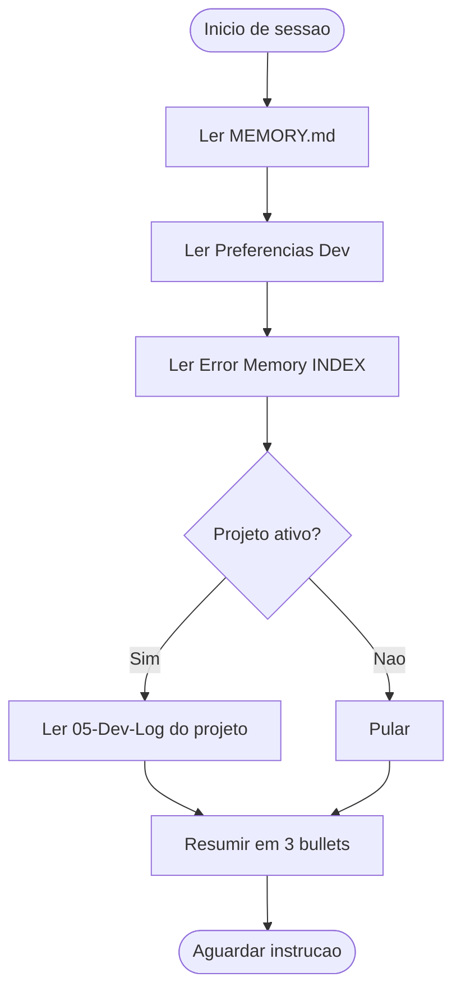
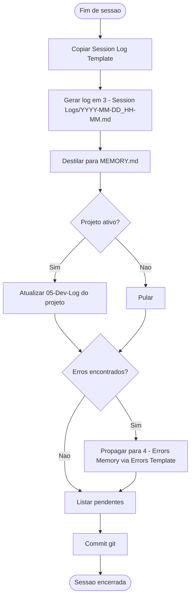

# M2 — Session Protocol & Memory Management

> ⚠️ **ESTE É O CANON DE BOOT/SHUTDOWN DO VAULT.** Qualquer outro arquivo (`cognitive-vault-manager/SKILL.md`, `INIT.md`) DEVE referenciar este protocolo — nunca redefinir uma sequência alternativa.
> ⚠️ **GATILHO BOOT:** início de qualquer sessão de trabalho no vault.
> ⚠️ **GATILHO SHUTDOWN:** fim de qualquer sessão.
> ⚠️ **TEMPLATE OBRIGATÓRIO (shutdown):** `[[Session Log Template]]` para o log da Camada 1.
> ⚠️ **OUTPUT BOOT:** estado restaurado + 3 bullets de resumo.
> ⚠️ **OUTPUT SHUTDOWN:** log em `Dev/3 - Session Logs/YYYY-MM-DD_HH-MM.md` + `[[MEMORY]]` atualizado + `[[05-Dev-Log]]` do projeto atualizado.

Este módulo define **como o agente inicia, opera e encerra** cada sessão de trabalho, e como as 3 camadas de memória são gerenciadas para garantir continuidade cognitiva entre sessões.

---

## Sub-fluxograma — Boot



## Sub-fluxograma — Shutdown



---

## Protocolo de Início de Sessão (Boot Sequence)

O agente **DEVE** executar esta sequência antes de gerar qualquer código ou resposta:

```yaml
boot_sequence:
  - passo: 1
    ação: "Ler MEMORY.md"
    arquivo: "Dev/3 - Session Logs/MEMORY.md"
    propósito: "Restaurar estado episódico — decisões recentes, bloqueios, progresso"

  - passo: 2
    ação: "Ler Preferencias Dev"
    arquivo: "Dev/0 - Planner Project/Preferencias Dev.md"
    propósito: "Carregar stack, metodologia e regras inegociáveis"

  - passo: 3
    ação: "Ler Error Memory Index"
    arquivo: "Dev/4 - Error's Memory/INDEX.md"
    propósito: "Carregar memória imunológica — erros conhecidos globalmente"

  - passo: 4
    ação: "Ler Dev-Log do projeto atual"
    arquivo: "[Projeto atual]/05-Dev-Log.md"
    propósito: "Restaurar contexto local do projeto em andamento"

  - passo: 5
    ação: "Resumir estado atual"
    formato: "3 bullets: o que foi feito, estado atual, próximos passos"

  - passo: 6
    ação: "Aguardar instrução"
    propósito: "Nunca agir autonomamente antes de receber direção do desenvolvedor"
```

---

## Protocolo de Encerramento de Sessão (Shutdown)

```yaml
shutdown_sequence:
  - passo: 1
    ação: "Gerar log de sessão a partir do [[Session Log Template]]"
    destino: "Dev/3 - Session Logs/YYYY-MM-DD_HH-MM.md"
    template: "[[Session Log Template]] — copiar e substituir variáveis"
    conteúdo: [resumo, decisões, erros encontrados, itens pendentes]

  - passo: 2
    ação: "Atualizar MEMORY.md"
    destino: "Dev/3 - Session Logs/MEMORY.md"
    regra: "Destilar aprendizados relevantes do log bruto para o índice curado"

  - passo: 3
    ação: "Atualizar Dev-Log do projeto"
    destino: "[Projeto atual]/05-Dev-Log.md"
    regra: "Registrar progresso, estado e decisões no contexto local"

  - passo: 4
    ação: "Propagar erros (se aplicável)"
    destino: "Dev/4 - Error's Memory/"
    regra: "Seguir protocolo do [[Immunological Error Memory]]"

  - passo: 5
    ação: "Listar itens pendentes"
    formato: "Checklist clara para a próxima sessão"

  - passo: 6
    ação: "Commitar mudanças via Git"
    condição: "Se versionamento configurado"
    comando: "git add . && git commit -m 'session: YYYY-MM-DD_HH-MM'"
```

---

## As 3 Camadas de Memória

### Camada 1 — Memória de Trabalho (Buffer)

| Atributo | Valor |
|---|---|
| **Localização** | `Dev/3 - Session Logs/*.md` |
| **Persistência** | Temporária / Semi-permanente |
| **Formato** | [[Session Log Template]] |
| **Função** | Snapshot bruto de cada sessão |

**Limpeza:** logs com mais de 30 dias já destilados para a Camada 2 podem ser arquivados.

### Camada 2 — Memória Episódica Curada

| Atributo | Valor |
|---|---|
| **Localização** | `Dev/3 - Session Logs/MEMORY.md` |
| **Persistência** | Permanente |
| **Função** | Índice destilado lido no boot — "memória recente" do sistema |

### Camada 3 — Memória Semântica (Base de Conhecimento)

| Atributo | Valor |
|---|---|
| **Localização** | Templates, Preferences, Methodology, Error Memory |
| **Persistência** | Permanente / Evolução lenta |
| **Acesso** | Via MCP, wikilinks ou RAG |
| **Função** | Base canônica — regras, padrões, templates |

---

## Heartbeat: Rotinas de Compactação

| Frequência | Ação |
|---|---|
| **A cada sessão** | Destilar log bruto → MEMORY.md |
| **Semanalmente** | Revisar MEMORY.md: remover obsoletos, consolidar decisões |
| **Mensalmente** | Arquivar Camada 1 antiga, revisar Error Memory INDEX |

---

## Integração com MCP

O agente prioriza navegação por wikilinks `[[]]` antes de buscas brutas. Isso garante menor consumo de tokens e maior precisão via RAG por grafo.

---

## Quality Gate (shutdown)

- [ ] **Log de sessão foi gerado a partir de `[[Session Log Template]]` como base**
- [ ] `[[MEMORY]]` destilado e atualizado
- [ ] `[[05-Dev-Log]]` do projeto atualizado (se aplicável)
- [ ] Erros propagados via `[[Errors Template]]` + `[[Immunological Error Memory]]` (se aplicável)
- [ ] Pendentes listados para próxima sessão
- [ ] Commit git executado (se versionamento configurado)

---

## Referências Internas

- `[[Master Pipeline & Enforcement]]` — matriz canon do vault (este protocolo é referenciado lá)
- `[[Cognitive Vault Architecture]]` — Estrutura de pastas e taxonomia
- `[[Immunological Error Memory]]` — Propagação de erros
- `[[Session Log Template]]` — Template para logs da Camada 1
