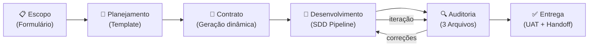

# Planner Mode — Phase One: Análise e Reestruturação

## 1. Diagnóstico do Documento Atual

Seu documento é **ambicioso e rico em conceitos** — ele descreve uma verdadeira arquitetura cognitiva para desenvolvimento assistido por IA. Porém, ele tem problemas estruturais que enfraquecem sua clareza e sua capacidade de servir como guia executável. Vou ser direto:

### ✅ O que está forte
- A visão de 3 camadas de memória (Trabalho → Episódica → Semântica) é sólida
- A matriz contratual dinâmica por tipo de projeto é original e pragmática
- O conceito de Mapeamento Sináptico com wikilinks é excelente
- A integração SDD (Spec-Driven Development) como pipeline é bem concebida

### ⚠️ O que precisa melhorar

| Problema | Descrição |
|---|---|
| **Mescla de conceitos** | O documento mistura *filosofia*, *arquitetura técnica*, *workflow operacional* e *estratégia jurídica* em um único texto corrido. Isso dificulta tanto a leitura humana quanto a ingestão pela IA |
| **Sem separação de fases** | Não fica claro o que é Phase One vs. o que é a visão completa. Tudo está descrito como se fosse para ser implementado de uma vez |
| **Redundância** | Vários parágrafos repetem a mesma ideia (ex.: otimização de tokens, prevenção de alucinações) em seções diferentes |
| **Falta de priorização** | Todos os componentes parecem ter a mesma prioridade. Não há um MVP definido |
| **Gap entre teoria e prática** | O documento descreve *o que* o sistema deve fazer, mas não *como* construí-lo. Faltam templates concretos, protocolos de sessão e schemas de dados |
| **Nomenclatura inconsistente** | "Nestx.js" vs NestJS, "Spacify" vs Spec-Kit, termos que podem confundir |

---

## 2. Arquitetura Proposta: Separação em Módulos

A ideia central deve ser decomposta em **5 módulos independentes**, cada um com seu próprio documento no vault. Isso segue exatamente a filosofia que você propõe: isolamento de contexto, ingestão otimizada de tokens, e documentação orientada à máquina.

```mermaid
graph TD
    A["🧠 Phase One: Planner Mode"] --> B["M1: Cognitive Vault<br/>Architecture"]
    A --> C["M2: Session Protocol<br/>& Memory Management"]
    A --> D["M3: Project Lifecycle<br/>Pipeline"]
    A --> E["M4: Dynamic Contract<br/>Engine"]
    A --> F["M5: Dev Preferences<br/>& Quality Standards"]
    
    B --> B1["Estrutura de pastas"]
    B --> B2["Taxonomia hierárquica"]
    B --> B3["Mapeamento sináptico"]
    
    C --> C1["Protocolo de início de sessão"]
    C --> C2["3 Camadas de memória"]
    C --> C3["Heartbeat / Compactação"]
    
    D --> D1["Formulário de Escopo"]
    D --> D2["Template de Planejamento"]
    D --> D3["Pipeline SDD (Spec-Kit)"]
    D --> D4["Auditoria via 3 Arquivos"]
    
    E --> E1["Cláusulas imutáveis"]
    E --> E2["Matriz condicional"]
    E --> E3["Geração automática"]
    
    F --> F1["Stack tecnológica"]
    F --> F2["Regras inegociáveis"]
    F --> F3["Documentos norteadores"]
```



---

## 3. Detalhamento dos Módulos

### Módulo 1 — Cognitive Vault Architecture
**Arquivo:** `0 - Planner Project/M1 - Cognitive Vault Architecture.md`

Define **como o vault é organizado** e **como os agentes navegam**.

**Conteúdo central:**
- Estrutura de pastas definitiva (`Dev/`)
- Regras de taxonomia hierárquica (`Projetos/[Nicho]/[Cliente-Projeto]/`)
- Artefatos obrigatórios por projeto (os 6 itens que você listou)
- Regras de Mapeamento Sináptico (wikilinks obrigatórios)
- Integração com Graph View para auditoria visual

**Situação atual no seu vault:**
```
Dev/
├── 0 - Planner Project/      ← Conceitos e visão (ESTE MÓDULO)
├── 0.1 - Metodology/         ← Os 3 agentes norteadores ✅
├── 0.2 - Audit/              ← Vazio ⚠️
├── 1 - Templates/            ← Contract + Requirements ✅
├── 2 - Projects/[Nicho]/     ← Placeholder ⚠️
└── 4 - Error's Memory/       ← Vazio ⚠️
```

> [!IMPORTANT]
> **Gap identificado:** Falta a pasta `3 - Session Logs/` para a Camada 1 de memória (logs brutos de sessão). Sem ela, metade da sua arquitetura de memória não tem onde viver.

**Estrutura de pastas proposta (revisada):**
```
Dev/
├── 0 - Planner Project/          ← Meta-documentação e visão
│   ├── M1 - Cognitive Vault Architecture.md
│   ├── M2 - Session Protocol.md
│   ├── M3 - Project Lifecycle Pipeline.md
│   ├── M4 - Dynamic Contract Engine.md
│   └── M5 - Dev Preferences & Quality Standards.md
│
├── 0.1 - Methodology/            ← Agentes norteadores (3 arquivos)
├── 0.2 - Audit/                  ← Templates e logs de auditoria
│
├── 1 - Templates/                ← Templates reutilizáveis
│   ├── Contract Template.md
│   ├── Requirements & Scope Project Template.md
│   ├── Planning Template.md          ← [NOVO] falta esse
│   └── Session Log Template.md       ← [NOVO] falta esse
│
├── 2 - Projects/                 ← Projetos por nicho
│   └── [Nicho]/
│       └── [Cliente-Projeto]/
│           ├── 01-Escopo.md
│           ├── 02-Contrato.md
│           ├── 03-Planejamento.md
│           ├── 04-Tarefas.md
│           ├── 05-Dev-Log.md
│           └── 06-Erros.md
│
├── 3 - Session Logs/             ← [NOVO] Camada 1 de memória
│   └── MEMORY.md                 ← [NOVO] Camada 2 (índice curado)
│
└── 4 - Error's Memory/          ← Memória imunológica global
    └── INDEX.md                  ← [NOVO] índice de erros recorrentes
```

---

### Módulo 2 — Session Protocol & Memory Management
**Arquivo:** `0 - Planner Project/M2 - Session Protocol.md`

Define **como o agente inicia, opera e encerra** cada sessão.

**Conteúdo central:**

#### Protocolo de Início de Sessão (Boot Sequence)
```yaml
# O agente DEVE executar esta sequência ao iniciar:
1. Ler: Dev/3 - Session Logs/MEMORY.md        # Camada 2
2. Ler: Dev/0 - Planner Project/M5 - *.md     # Dev Preferences
3. Ler: [Projeto atual]/05-Dev-Log.md          # Contexto local
4. Resumir: estado atual em 3 bullets
5. Aguardar: instrução do desenvolvedor
```

#### Protocolo de Encerramento de Sessão (Shutdown)
```yaml
# O agente DEVE executar ao finalizar:
1. Gerar: log de sessão → Dev/3 - Session Logs/YYYY-MM-DD_HH-MM.md
2. Atualizar: MEMORY.md com decisões e estado atual
3. Listar: itens pendentes para próxima sessão
4. Commitar: mudanças no vault via Git (se configurado)
```

#### 3 Camadas de Memória

| Camada | Armazenamento | Ciclo de Vida | Ação do Agente |
|---|---|---|---|
| **1 — Trabalho** | `3 - Session Logs/*.md` | Buffer diário | Grava automaticamente |
| **2 — Episódica** | `3 - Session Logs/MEMORY.md` | Permanente, curada | Destila da Camada 1 |
| **3 — Semântica** | Templates, Preferences, Methodology | Permanente, imutável | Consulta via MCP/RAG |

---

### Módulo 3 — Project Lifecycle Pipeline
**Arquivo:** `0 - Planner Project/M3 - Project Lifecycle Pipeline.md`

Define o **fluxo completo** de um projeto, do primeiro contato à entrega.



**Conteúdo central:**

1. **Intake (Escopo):**
   - Formulário baseado no template `1 - Templates/Requirements & Scope Project Template.md`
   - Frontmatter YAML obrigatório para metadados extraíveis
   - Seções com marcação semântica (GIVEN/WHEN/THEN para critérios de aceite)

2. **Planning (Planejamento):**
   - Geração automática via `/speckit.plan` a partir do escopo
   - Estrutura: Resumo Executivo → EAP → Cronograma → Stack → Riscos → UAT

3. **SDD Pipeline (4 fases):**

   | Fase | Comando Spec-Kit | Input | Output |
   |---|---|---|---|
   | Especificar | `/speckit.specify` | Descrição alto nível | Jornadas + Critérios de sucesso |
   | Planejar | `/speckit.plan` | Especificação + Preferences | Arquitetura + Endpoints + Schemas |
   | Gerar Tarefas | `/speckit.tasks` | Plano técnico | Lista granular de tarefas |
   | Implementar | `/speckit.implement` | Tarefa individual | Código + Testes |

4. **Auditoria (Metodologia dos 3 Arquivos):**
   - Input: código-fonte (não screenshots)
   - Auditoria contra: [ai-portfolio-product-strategist.md](file:///f:/1-ZECA/1-Repositorio/Documentos/MeusProjetos/Dev/Dev/0.1%20-%20Metodology/ai-portfolio-product-strategist.md), [ai-web-designer-agent.md](file:///f:/1-ZECA/1-Repositorio/Documentos/MeusProjetos/Dev/Dev/0.1%20-%20Metodology/ai-web-designer-agent.md), [ai-portfolio-copy-architect.md](file:///f:/1-ZECA/1-Repositorio/Documentos/MeusProjetos/Dev/Dev/0.1%20-%20Metodology/ai-portfolio-copy-architect.md)
   - Ferramenta: `/speckit.analyze`

---

### Módulo 4 — Dynamic Contract Engine
**Arquivo:** `0 - Planner Project/M4 - Dynamic Contract Engine.md`

Define a **lógica de geração de contratos** baseada no tipo de projeto.

**Conteúdo central:**

#### Cláusulas Imutáveis (Base)
- Propriedade Intelectual (IP): código entregue após liquidação total
- Controle de Escopo: funcionalidades extras = Ordem de Mudança
- NDA (Confidencialidade)
- Resolução de Disputas

#### Matriz Condicional

| Classificação | Cláusulas Injetadas | Risco Mitigado |
|---|---|---|
| **Frontend do Zero** | Limitação backend + Dependência de APIs | Culpa por falhas de servidor |
| **Full-stack do Zero** | Transição de infra + Garantia de segurança | Suporte perpétuo grátis |
| **Refatoração Frontend** | Descoberta tech debt + Recalibragem | Custos ocultos de código legado |
| **Refatoração Full-stack** | Auditoria prévia + Isenção downtime | Litígio por indisponibilidade |

#### Gatilho
```
SE classificação_servico == "Refatoração Full-stack":
    INJETAR cláusula_auditoria_prévia
    INJETAR cláusula_isenção_downtime
    REMOVER cláusula_garantia_uptime
```

---

### Módulo 5 — Dev Preferences & Quality Standards
**Arquivo:** `0 - Planner Project/M5 - Dev Preferences & Quality Standards.md`

Versão expandida e corrigida do `Develop Preferences.md` (atualmente vazio).

**Conteúdo central:**

#### Stack Aprovada

| Camada | Tecnologia | Regra para a IA |
|---|---|---|
| Linguagem | TypeScript | `any` proibido. Interfaces explícitas obrigatórias |
| Backend | NestJS | Arquitetura modular + DI. Lógica nos Services, nunca nos Controllers |
| Frontend | React ou Angular | Decidido por projeto. React: functional + hooks + Server Components |
| Styling | Tailwind + Shadcn/ui | Zero CSS global. Tokens do `tailwind.config.ts` |
| Animações | GSAP + Lenis | `useGSAP` obrigatório. Respeitar `prefers-reduced-motion` |
| Package Manager | pnpm | npm/yarn/bun banidos |
| Pipeline | Spec-Kit | SDD obrigatório antes de qualquer código |

#### Regras de Qualidade
- Estado assíncrono: React Query ou SWR (nunca `useEffect` puro para fetching)
- Animações: nunca bloquear main thread
- Cores: apenas tokens do config, nunca hex hardcoded
- Acessibilidade: WCAG compliance obrigatório

---

## 4. O que Falta para Phase One Funcionar (MVP)

> [!CAUTION]
> Sem estes itens, o sistema descrito no documento é uma visão, não uma ferramenta operacional.

| # | Item Faltante | Prioridade | Ação |
|---|---|---|---|
| 1 | **`Develop Preferences.md` está vazio** | 🔴 Crítica | Preencher com as regras do Módulo 5 |
| 2 | **Falta `Planning Template.md`** | 🔴 Crítica | Criar em `1 - Templates/` baseado no Módulo 3 |
| 3 | **Falta `Session Log Template.md`** | 🟡 Alta | Criar para padronizar Camada 1 de memória |
| 4 | **Falta pasta `3 - Session Logs/`** | 🟡 Alta | Criar com `MEMORY.md` (Camada 2) |
| 5 | **`4 - Error's Memory/` está vazio** | 🟡 Alta | Criar `INDEX.md` como catálogo global |
| 6 | **`0.2 - Audit/` está vazio** | 🟠 Média | Definir templates de auditoria |
| 7 | **Protocolo de sessão não está codificado** | 🟠 Média | Criar como skill reutilizável |
| 8 | **Lógica de contrato não está automatizada** | 🟢 Futura | Implementar como script ou prompt chain |

---

## 5. Próximos Passos Recomendados

### Fase Imediata (Phase One real)
1. **Decompor** o documento monolítico nos 5 módulos propostos
2. **Preencher** o `Develop Preferences.md` com as regras da stack
3. **Criar** os templates faltantes (Planning + Session Log)
4. **Criar** a estrutura de pastas completa (Session Logs + MEMORY.md + Error Index)

### Fase Seguinte
5. Codificar o protocolo de sessão como uma skill/instrução customizada
6. Criar um projeto-piloto usando o pipeline completo
7. Validar a matriz contratual com um cenário real

---

## 6. Perguntas para Você

1. **Quer que eu crie os 5 arquivos modulares** decompondo o documento atual, ou prefere fazer isso manualmente no Obsidian?

2. **O `Develop Preferences.md` vazio é intencional** (aguardando preenchimento) ou foi esquecido? Posso preenchê-lo com base no que você descreveu no Phase One.

3. **Os 3 arquivos de metodologia** (`ai-portfolio-*`) são específicos do seu portfólio pessoal ou são genéricos para todos os projetos de clientes? Isso muda como eles devem ser referenciados no pipeline.

4. **Você já usa o Spec-Kit/Spacify** ativamente, ou essa é uma integração planejada para o futuro?

5. **A geração de contratos dinâmicos** deve ser automatizada (script que gera o contrato final) ou semi-automática (IA sugere cláusulas, você monta)?
