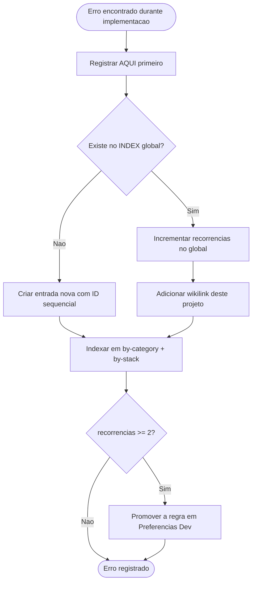

# 🐛 06-Erros — {{PROJECT_NAME}}

> **Nota de Uso:** Template canon para `06-Erros.md`. Inicializado pelo `[[Protocol-Bootstrap]]` no setup do projeto. Toda entrada é propagada para a memória imunológica global.
>
> ⚠️ **ESPELHADO EM MEMÓRIA IMUNOLÓGICA GLOBAL.** Toda entrada aqui deve ser propagada para `[[4 - Error's Memory/INDEX]]` seguindo o protocolo de deduplicação de `[[Immunological Error Memory]]`.
>
> ⚠️ **Schema obrigatório:** idêntico ao do `[[Immunological Error Memory]]`. Não simplificar campos.

---

## Erros do Projeto

```yaml
- id: ERR-YYYY-NNNN          # sequencial global (consultar INDEX antes)
  título: "Descrição curta e clara"
  categoria: State Management   # ver Immunological Error Memory para enum
  stack:
    - React
    - GSAP & Lenis
  severidade: alta              # baixa | média | alta | crítica
  projeto_origem: "{{MARKET_NICHE}}/{{PROJECT_NAME}}"
  data_descoberta: YYYY-MM-DD
  sintoma: "Mensagem de erro ou comportamento observado"
  causa_raiz: "Explicação técnica do porquê aconteceu"
  solução: "O que foi feito para resolver"
  prevenção: "Como evitar que aconteça novamente"
  recorrências: 0
  propagado_para_global: false  # marcar true quando entrar no INDEX
  links:
    - "[[4 - Error's Memory/INDEX]]"
    - "[[4 - Error's Memory/by-stack/<tecnologia>]]"
    - "[[4 - Error's Memory/by-category/<categoria>]]"
```

---

## Quality Gate (antes de propagar)

- [ ] Artefato foi gerado a partir de `[[Errors Template]]` como base
- [ ] ID consultado no `[[4 - Error's Memory/INDEX]]` (não duplicar)
- [ ] Todos os campos obrigatórios preenchidos (`sintoma`, `causa_raiz`, `solução`, `prevenção`)
- [ ] `stack` lista pelo menos uma tecnologia
- [ ] `severidade` definida (não vazio)
- [ ] Entrada criada em `[[INDEX]]` global + `by-category/` + `by-stack/`
- [ ] `propagado_para_global: true` atualizado após sincronização

---

## Fluxo de Propagação



> Protocolo completo: `[[Immunological Error Memory]]`

---

## Referências

- `[[Immunological Error Memory]]` — protocolo global
- `[[4 - Error's Memory/INDEX]]` — catálogo global
- `[[Preferencias Dev]]` — destino das regras promovidas (recorrências >= 2)
- `[[Protocol-Bootstrap]]` — protocolo que inicializa este arquivo
