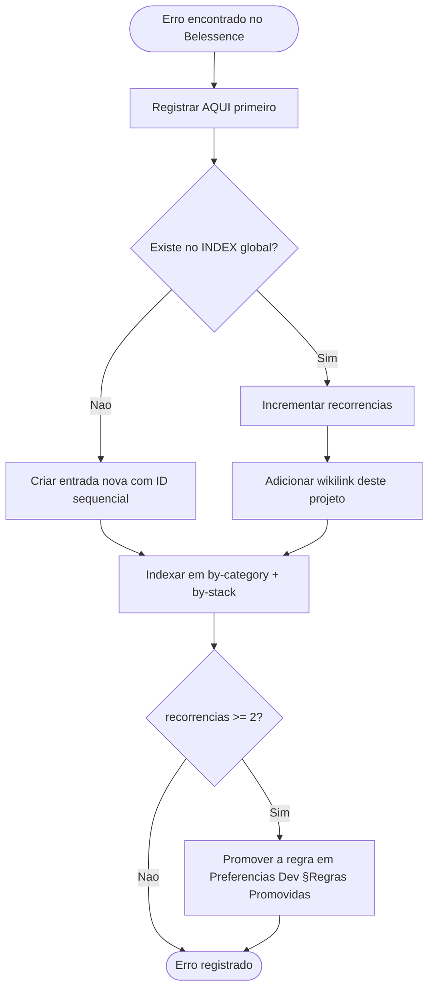

# 🐛 06-Erros — Belessence (Mari Beauty)

> ⚠️ **ESPELHADO EM MEMÓRIA IMUNOLÓGICA GLOBAL.** Toda entrada aqui é propagada para `[[4 - Error's Memory/INDEX]]` seguindo o protocolo de deduplicação de `[[Immunological Error Memory]]`.
>
> ⚠️ **Schema obrigatório:** idêntico ao do `[[Immunological Error Memory]]`. Não simplificar campos.

---

## Erros do Projeto

```yaml
- id: ERR-2026-0003
  título: "Auth.js v5 com Credentials Provider exige session.strategy='jwt'"
  categoria: Auth & Security
  stack:
    - next-auth
    - React
  severidade: alta
  projeto_origem: "Ecommerce/Belessence"
  data_descoberta: 2026-04
  sintoma: "Sessão de credentials não persistia; usuário deslogado logo após login. Erros do tipo 'cannot read property of session' em RSC."
  causa_raiz: "Auth.js v5 (NextAuth) com Credentials Provider NÃO suporta `session.strategy='database'`. Tem que ser 'jwt'. O default mudou em v5 em relação ao v4 e a documentação não é óbvia."
  solução: |
    Em `src/lib/auth.ts`, definir explicitamente:
    ```ts
    export const { handlers, auth, signIn, signOut } = NextAuth({
      adapter: PrismaAdapter(prisma),
      session: { strategy: "jwt" }, // OBRIGATÓRIO com credentials
      providers: [Credentials({ ... }), Google({ ... })],
      callbacks: {
        session({ session, token }) {
          session.user.id = token.sub!;
          return session;
        },
      },
    });
    ```
  prevenção: |
    Antes de usar Credentials Provider, verificar Context7 Auth.js v5 ou docs oficiais.
    Quando misturar Credentials + OAuth, JWT strategy é compulsório.
  recorrências: 0
  propagado_para_global: false
  links:
    - "[[4 - Error's Memory/INDEX]]"
    - "[[next-auth|Next-Auth]]"
    - "[[auth-security|Auth & Security]]"

- id: ERR-2026-0004
  título: "PrismaAdapter exige tabelas em snake_case (Account, Session, VerificationToken)"
  categoria: Auth & Security
  stack:
    - next-auth
    - Prisma
  severidade: média
  projeto_origem: "Ecommerce/Belessence"
  data_descoberta: 2026-04
  sintoma: "Erros 'Unknown field' ou 'Cannot find table' ao tentar login OAuth ou criar conta de credentials."
  causa_raiz: "@auth/prisma-adapter usa nomes específicos pras tabelas Account, Session, VerificationToken, User, e campos em snake_case (provider_account_id, expires_at, etc). Renomear quebra o adapter."
  solução: |
    Manter o schema EXATAMENTE como gerado pelo `prisma init` + Auth.js:
    ```prisma
    model Account {
      id                 String  @id @default(cuid())
      userId             String
      type               String
      provider           String
      providerAccountId  String  @map("provider_account_id")
      refresh_token      String? @db.Text
      access_token       String? @db.Text
      expires_at         Int?
      token_type         String?
      // ... (NÃO renomear pra camelCase)
    }
    ```
    Os `@map` são obrigatórios.
  prevenção: |
    Copiar o schema de exemplo da doc oficial do @auth/prisma-adapter ou de um projeto Auth.js + Prisma funcional.
    Não "limpar" o snake_case dos campos OAuth.
  recorrências: 0
  propagado_para_global: false
  links:
    - "[[4 - Error's Memory/INDEX]]"
    - "[[next-auth|Next-Auth]]"
    - "[[auth-security|Auth & Security]]"

- id: ERR-2026-0005
  título: "Postgres SSL warning em produção sem driver adapter (Prisma 7)"
  categoria: Deployment
  stack:
    - Prisma
    - PostgreSQL
  severidade: média
  projeto_origem: "Ecommerce/Belessence"
  data_descoberta: 2026-05
  sintoma: |
    Logs de produção (Vercel) mostrando:
    `(node) Warning: SSL connection forced without server CA validation`
    Sem certeza se a conexão estava sendo encriptada de fato.
  causa_raiz: "Prisma 7 com Postgres + provider padrão não respeita corretamente `sslmode=require` em DATABASE_URL quando rodando em Edge ou em runtimes específicos. Solução é usar o driver adapter `@prisma/adapter-pg` que aceita config SSL explícita no `Pool`."
  solução: |
    Instalar:
    ```bash
    pnpm add @prisma/adapter-pg pg
    pnpm add -D @types/pg
    ```
    Em `src/lib/prisma.ts`:
    ```ts
    import { PrismaPg } from "@prisma/adapter-pg";
    import { Pool } from "pg";
    import { PrismaClient } from "@/generated/prisma";
    
    const pool = new Pool({
      connectionString: process.env.DATABASE_URL,
      ssl: { rejectUnauthorized: false }, // ou true + CA cert
    });
    const adapter = new PrismaPg(pool);
    
    const prisma = global.prisma ?? new PrismaClient({ adapter });
    if (process.env.NODE_ENV !== "production") global.prisma = prisma;
    export default prisma;
    ```
    Em `prisma.config.ts`: `previewFeatures = ["driverAdapters"]`.
  prevenção: |
    Em Prisma 7+, sempre usar driver adapter quando estiver em ambiente serverless / Edge.
    Verificar warnings de SSL logo no primeiro deploy.
  recorrências: 0
  propagado_para_global: false
  links:
    - "[[4 - Error's Memory/INDEX]]"
    - "[[prisma|Prisma]]"
    - "[[deployment|Deployment]]"

- id: ERR-2026-0006
  título: "Carrinho/Wishlist em localStorage GLOBAL vazava entre usuários no mesmo browser"
  categoria: Auth & Security
  stack:
    - Zustand
    - React
  severidade: crítica
  projeto_origem: "Ecommerce/Belessence"
  data_descoberta: 2026-04
  sintoma: "Usuário A faz logout, usuário B faz login no mesmo browser, e B vê os itens do carrinho/favoritos de A. Bug de privacidade severo."
  causa_raiz: "Zustand com middleware `persist({ name: 'cart' })` salvava o estado em `localStorage` SEM vinculo com `userId`. Como localStorage é por origin (não por usuário), o próximo usuário no mesmo browser herdava o estado. Logout não limpava o store."
  solução: |
    1. Modelar cart/wishlist como tabelas no banco com `userId` FK + `@@unique([userId, productId])`:
       ```prisma
       model CartItem {
         id        String   @id @default(cuid())
         userId    String
         productId String
         quantity  Int
         user      User     @relation(fields: [userId], references: [id], onDelete: Cascade)
         product   Product  @relation(fields: [productId], references: [id])
         @@unique([userId, productId])
       }
       ```
    2. Zustand vira CACHE do servidor (sem `persist`):
       ```ts
       export const useCartStore = create<CartState>((set) => ({
         items: [],
         hydrate: (items) => set({ items }),
         reset: () => set({ items: [] }),
       }));
       ```
    3. Server Actions pegam `userId` via `auth()` e persistem via Prisma. No-op se deslogado.
    4. No login: `AuthDataSync` hidrata stores do banco. No logout: `reset()` em todas as stores.
    5. Preço sempre relido do `Product.price` atual no servidor — nunca confiar no client.
  prevenção: |
    **REGRA INEGOCIÁVEL:** Dados privados por usuário NUNCA podem viver em localStorage global sem vinculo de identidade.
    - Stores Zustand: ou usam `persist` com `name` por-usuário (ex: `cart-${userId}`) E limpam no logout
    - OU não usam `persist` e são puro cache do servidor (recomendado)
    Auditar TODA store Zustand em projetos com auth antes de declarar feature done.
  recorrências: 0
  propagado_para_global: false
  links:
    - "[[4 - Error's Memory/INDEX]]"
    - "[[zustand|Zustand]]"
    - "[[react|React]]"
    - "[[auth-security|Auth & Security]]"
```

---

## Quality Gate (antes de propagar pra global)

- [x] Artefato foi gerado a partir de `[[Errors Template]]` como base
- [x] IDs sequenciais consultados no `[[4 - Error's Memory/INDEX]]` (próximo era ERR-2026-0003)
- [x] Todos os campos obrigatórios preenchidos (`sintoma`, `causa_raiz`, `solução`, `prevenção`)
- [x] `stack` lista pelo menos uma tecnologia por erro
- [x] `severidade` definida em cada
- [ ] Entrada criada em `[[INDEX]]` global + `by-category/` + `by-stack/` (próximo passo T-1.11.b)
- [ ] `propagado_para_global: true` atualizado após sincronização

---

## Fluxo de Propagação



> Protocolo completo: `[[Immunological Error Memory]]`

---

## Observação sobre recorrências

Cada um dos 4 erros acima tem `recorrencias: 0` pq é a primeira vez sendo formalmente registrado. Mas o **ERR-2026-0006 (cart vazamento)** é fortemente recorrente em projetos com auth + state client persistido. Se aparecer em qualquer projeto novo, a regra deve ser **promovida** em `[[Preferencias Dev#Regras Promovidas da Memória Imunológica]]` como:

> **Regra (promovida):** Em qualquer projeto com autenticação, stores client-side (Zustand/Redux/Pinia/etc) NÃO podem persistir em localStorage global. Dados privados por usuário vivem em banco, e o store é puro cache do servidor (sem `persist`) ou tem chave por-usuário com reset no logout.

---

## Referências

- `[[Immunological Error Memory]]` — protocolo global
- `[[4 - Error's Memory/INDEX]]` — catálogo global
- `[[Preferencias Dev]]` — destino das regras promovidas
- `[[Protocol-Bootstrap]]` — protocolo que inicializou este arquivo
- `[[Errors Template]]` — template canon
