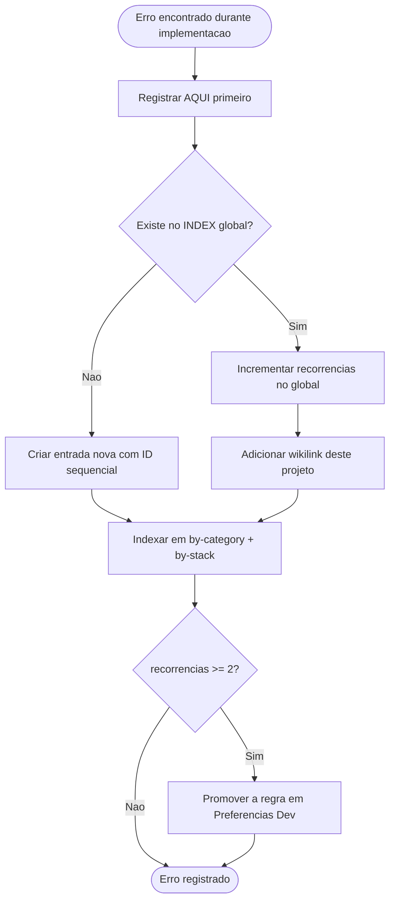

# 🐛 06-Erros — BipDay

> Inicializado no bootstrap. Toda entrada de **erro de código** é propagada para [[4 - Error's Memory/INDEX]].

---

## Erros do Projeto

### ERR-BIPDAY-001 — `error=Configuration` no callback do Google (schema NOT NULL quebra o adapter)

| Campo | Valor |
|---|---|
| **Data** | 2026-07-21 |
| **Stack** | Auth.js v5 (`@auth/prisma-adapter`) + Prisma 7 + Postgres |
| **Sintoma** | Login Google redireciona OK, usuário escolhe a conta, e o callback retorna `GET /api/auth/error?error=Configuration 500`. Falha **depois** de escolher a conta (não é `redirect_uri_mismatch`). |
| **Causa raiz** | `users.username` estava `String @unique` (**NOT NULL, sem default**). No 1º login o `PrismaAdapter.createUser` insere só `{name,email,emailVerified,image}` — sem `username`. O Postgres rejeita o INSERT; o `createUser` estoura e o Auth.js v5 mascara **qualquer** falha de adapter como `error=Configuration`. |
| **Correção** | `username String? @unique` (nullable até o onboarding US2) → `db push` + `generate`. A intenção do código sempre foi esta (callback `jwt` já tratava `username` null). |
| **Lição** | Campos de negócio obrigatórios num model gerido pelo adapter do Auth.js **precisam ser nullable ou ter default** — o adapter só popula os campos canônicos do `AdapterUser`. E: no Auth.js v5, `error=Configuration` no callback ≈ "o adapter lançou"; ler o `[auth][error]` do terminal, não confiar no código da URL. |

_Propagar para [[4 - Error's Memory/INDEX]] (1ª ocorrência — categoria: auth/adapter · stack: Auth.js+Prisma)._

> **Aprendizados de tooling/ambiente do bootstrap** (não são bugs do projeto — registrados no [[05-Dev-Log]], não propagados à memória imunológica):
> - pnpm 11 usa `allowBuilds:` (mapa nome→boolean) no `pnpm-workspace.yaml` para aprovar build scripts — não `onlyBuiltDependencies`. Sem isso, `prisma`/`sharp`/`esbuild` ficam sem build e `prisma generate` falha.
> - Prisma 7 `db push` removeu a flag `--skip-generate`.
> - Prisma 7 exige `DATABASE_URL` resolvível já no `generate` (por causa do `datasource.url: env()` no `prisma.config.ts`) — usar placeholder no `.env` antes da URL real destrava.

---

## Quality Gate (antes de propagar)

- [x] Gerado a partir de [[Errors Template]]
- [x] Nenhum erro de código a propagar ainda (só aprendizados de ambiente, mantidos locais)

---

## Fluxo de Propagação

> Protocolo completo: [[Immunological Error Memory]]

## Referências
- [[Immunological Error Memory]] · [[4 - Error's Memory/INDEX]] · [[Preferencias Dev]] · [[Protocol-Bootstrap]]
